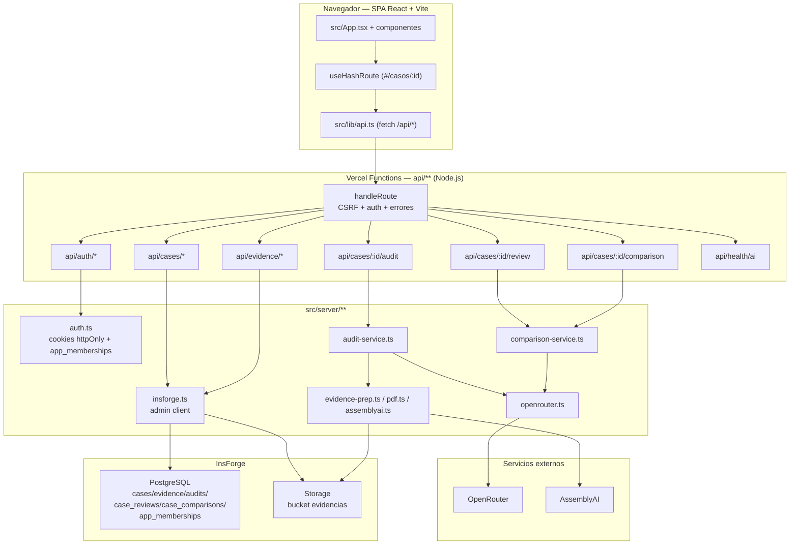
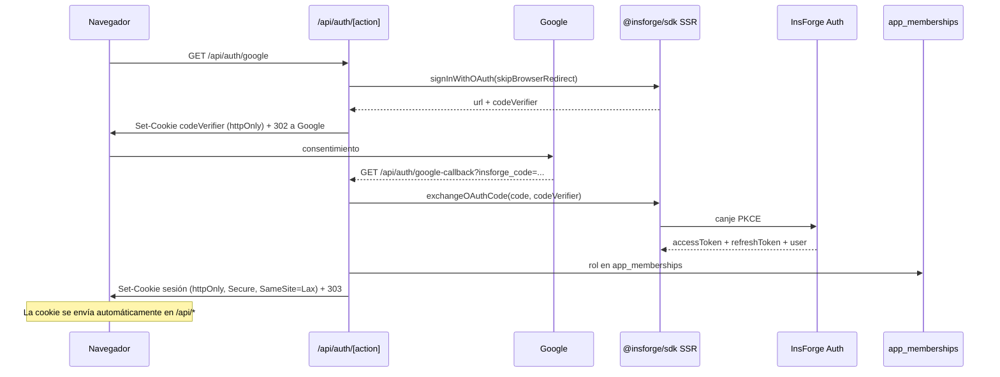
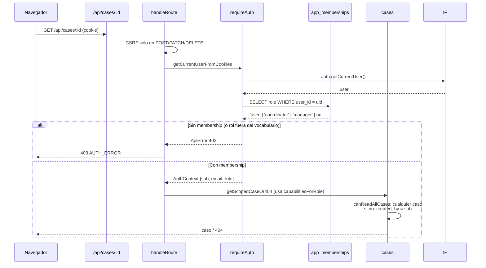
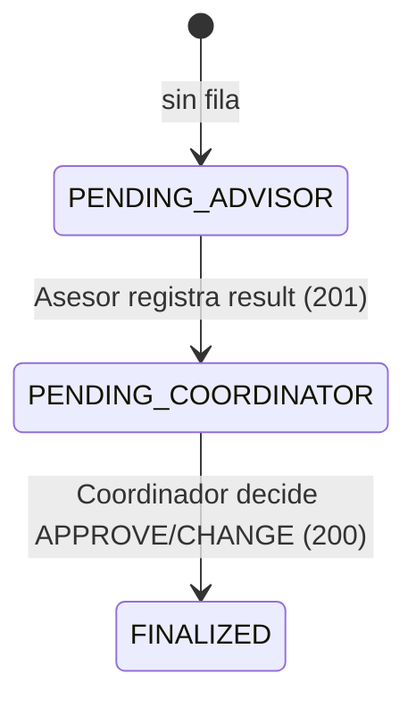

# Arquitectura — Cancelaciones AI

> Para el flujo de auditoría ver [`docs/AUDIT_PIPELINE.md`](AUDIT_PIPELINE.md); para el despliegue real ver [`docs/DEPLOYMENT.md`](DEPLOYMENT.md).

## Resumen

Aplicación **AI-native** para la auditoría de cancelaciones, bajas y deserción de estudiantes UTEL.
El producto no tiene motor normativo, rules engine ni catálogo ejecutable de reglas.
La única inteligencia vive en `src/skills/audit/`, que lee el expediente y el Procedimiento V5 entregado por el owner e inyectado en el contexto del modelo.
El backend no reclasifica: valida, persiste y agrega metadata técnica real.

La interfaz es una SPA React + Vite con hash routing manual; el backend son Vercel Functions bajo `api/**`; InsForge (PostgreSQL, Auth, Storage) y OpenRouter son servicios externos, **siempre accedidos desde el servidor**. El navegador nunca habla con InsForge ni con OpenRouter.

## Stack tecnológico

| Capa | Tecnología | Archivos clave |
|---|---|---|
| Frontend | React 19 + Vite 6 + TypeScript + Tailwind CSS | `src/App.tsx`, `src/components/**`, `src/lib/**` |
| Routing | Hash routing manual | `src/lib/useHashRoute.ts` |
| Backend | Vercel Functions (Node) | `api/**` |
| Dev server | `scripts/dev-api.mjs` monta `api/**` dentro de Vite | `scripts/dev-api.mjs`, `vite.config.ts` |
| Auth | InsForge SDK SSR + cookies httpOnly + `app_memberships` | `src/server/auth.ts`, `api/auth/[action].ts` |
| Base de datos | InsForge PostgreSQL | `migrations/*.sql` |
| Storage | InsForge Storage bucket `evidencias` | `src/server/insforge.ts` |
| IA | OpenRouter (único proveedor) | `src/server/openrouter.ts`, `src/server/ai/*` |
| Transcripción | AssemblyAI (solo audio) | `src/server/assemblyai.ts` |
| Validación | Zod estricto | `src/skills/audit/schema.ts`, `src/skills/review/schema.ts` |
| Procedimiento | `policy/` compilado a TS | `scripts/generate-policy.mjs`, `src/skills/audit/procedure-v5.ts` |

## Estructura del proyecto

```text
cancelaciones-ai/
├── api/                        # Vercel Functions (un handler por archivo)
│   ├── auth/[action].ts        # Google OAuth, sesión y refresh
│   ├── cases/index.ts          # GET listar / POST crear caso
│   ├── cases/[caseId]/index.ts # GET detalle / PATCH fecha de inicio
│   ├── cases/[caseId]/evidence/index.ts        # POST subir evidencia
│   ├── cases/[caseId]/evidence/[evidenceId]/index.ts # DELETE borrar
│   ├── cases/[caseId]/audit/index.ts           # GET poll / POST auditar
│   ├── cases/[caseId]/review/index.ts          # GET/POST revisión humana
│   ├── cases/[caseId]/comparison/index.ts      # POST reintentar comparación
│   ├── cases/[caseId]/area-comments/index.ts   # GET/PUT bitácora por área
│   ├── dashboard/[view].ts     # summary, ai-costs, quality, options
│   ├── evidence/[evidenceId]/download.ts       # GET descargar/preview
│   └── health/ai.ts            # healthcheck de configuración IA
├── src/
│   ├── components/             # UI React
│   │   ├── CaseReviewPanel.tsx # etapa del Asesor y ciclo de comparación IA
│   │   ├── CoordinatorReviewStage.tsx # finalización y registro del Coordinador
│   │   └── useCaseAuditWorkflow.ts # ejecución, recuperación y polling de auditoría
│   ├── lib/                    # Cliente API, utilidades, hooks
│   ├── server/                 # Helpers server-side (no tocan el navegador)
│   │   ├── capabilities.ts     # Roles y capacidades (módulo hoja)
│   │   ├── auth.ts             # Sesiones, requireAuth, app_memberships, guards
│   │   ├── insforge.ts         # Cliente admin server-side
│   │   ├── http.ts             # handleRoute, CSRF, errores, cookies
│   │   ├── cases.ts            # Persistencia de casos/evidencias/auditorías
│   │   ├── reviews.ts          # Persistencia de revisiones/comparaciones
│   │   ├── area-comments.ts    # Bitácora por área (UPSERT)
│   │   ├── dashboard-queries.ts # Consultas PostgREST, alcance de rol y filtros
│   │   ├── dashboard-summary.ts # Resultados, acuerdo humano y resumen
│   │   ├── dashboard-costs.ts   # Costos, tokens y latencia
│   │   ├── dashboard-quality.ts # Confianza y comparación humana
│   │   ├── dashboard-contracts.ts # Filas y tamaño de página compartidos
│   │   ├── dashboard.ts        # Barrel compatible para consumidores
│   │   ├── dto.ts              # DTOs, deriveWorkflowState, deriveEffectiveResolution
│   │   ├── audit-service.ts    # Orquestación durable de auditoría
│   │   ├── comparison-service.ts # Orquestación de revisión humana
│   │   ├── evidence-prep.ts    # Hash, MIME, nombres, transcripción
│   │   ├── pdf.ts              # Extracción de texto PDF
│   │   ├── assemblyai.ts       # Transcripción de audio
│   │   ├── openrouter.ts       # Transporte único de IA
│   │   └── ai/*                # Capabilities, provider schema
│   └── skills/
│       ├── audit/              # Única inteligencia de auditoría
│       │   ├── types.ts        # Vocabulario cerrado
│       │   ├── schema.ts       # Zod estricto + reglas semánticas
│       │   ├── instructions.ts # System prompt + anti prompt-injection
│       │   ├── procedure-v5.ts # Procedimiento compilado
│       │   └── execute.ts      # Arma expediente y llama OpenRouter
│       └── review/             # Comparación IA vs. decisión humana
│           ├── types.ts
│           ├── schema.ts
│           ├── instructions.ts
│           └── execute.ts
├── policy/                     # Fuente normativa oficial V5
├── migrations/                 # SQL forward-only
└── scripts/                    # generate-policy, dev-api, check-no-public-secrets
```

## Flujo de datos

### Diagrama general



### Secuencia de login



### Scoping por ownership



## Límite de confianza

El navegador envía cookies de sesión a `/api/*`, pero no recibe tokens de InsForge ni claves de proveedores. `handleRoute` (`src/server/http.ts`) valida CSRF en métodos mutantes y resuelve la sesión y el membership antes de ejecutar cada handler protegido. Las rutas usan un cliente administrativo server-side, por lo que aplican además alcance por propietario con `getScopedCaseOr404`; quien tiene `canReadAllCases` (`coordinator`, `manager`) puede consultar cualquier caso, y solo el propietario puede modificarlo.

**La autorización se decide por capacidad, no por nombre de rol.** `capabilitiesForRole` (`src/server/capabilities.ts`) deriva cuatro capacidades del rol verificado y los endpoints preguntan "¿TIENE la capacidad?", nunca "¿el rol es exactamente este?". Los guards son `assertCaseWriteCapability` (capacidad antes que propiedad) y `assertCaseOwner` (propiedad: un caso ajeno es `404`). Rol desconocido, `null` o `undefined` → todo negado (fail-closed). **La RLS no es la frontera**: el servidor escribe con `project_admin` (BYPASSRLS), así que las políticas no lo restringen; son defensa en profundidad ante una fuga de cookie.

El backend separa transporte y criterio: `api/**` valida y delega; `src/server/**` coordina persistencia e integraciones; `src/skills/audit/**` es la única fuente de criterio asistido por IA. `cases.country` y `cases.channel` son proyecciones de `audits.result_json.origin`, no datos normativos independientes.

## Roles, capacidades y revisión de dos etapas

Tres roles persistidos en `app_memberships.role`; `user` se presenta como **Asesor** (no se renombra ni migra):

| Rol | Presentación | `canReadAllCases` | `canReviewOwnCases` | `canFinalizeAnyCase` | `canWriteOwnedCases` |
| --- | --- | --- | --- | --- | --- |
| `user` | Asesor | no | sí | no | sí |
| `coordinator` | Coordinador | sí | no | sí | sí |
| `manager` | Gerente | sí | no | no | no |

La revisión humana tiene dos etapas y el estado se **deriva en lectura** de `case_reviews` con `deriveWorkflowState` (no es una columna ni `cases.status`):



- **Asesor**: `POST /api/cases/:id/review { result, comment? }` sobre su caso → `201`, dispara la comparación IA; un segundo intento es `409`.
- **Coordinador**: `POST ... { decision: 'APPROVE'|'CHANGE', resolution?, comment? }` sobre cualquier caso → `200`. `APPROVE` conserva `result`; `CHANGE` exige `resolution` distinta. La decisión del coordinador se guarda aparte y no pisa la del Asesor.
- **Gerente**: lee, pero `POST /review` es `403`.

En la UI, `CaseReviewPanel` presenta la etapa del Asesor y el estado/reintento de
la comparación; `CoordinatorReviewStage` presenta por separado la finalización
del Coordinador y su decisión ya registrada. Este límite organiza componentes:
la autorización efectiva sigue en los guards de la API.

`cases.is_test` (default `false`) marca pruebas y el **servidor** las excluye de las métricas operativas en SQL (`is_test = false`), no la base. La vista previa local `?preview=dashboard&role=…&workflow=…` (`src/lib/local-ui-preview.ts`) es SOLO presentación: no llama a la API ni resuelve sesión, así que cambiar el rol del preview no altera ninguna autorización real.

## Ciclo de una auditoría

1. La persona crea un caso y carga una evidencia. La Function valida sesión, propietario, método, tamaño, MIME, firma de archivo y cuota antes de escribir. `src/server/evidence-prep.ts` normaliza nombre/MIME y calcula hash; el binario original se conserva en InsForge Storage.
2. Los PDF se preparan con `src/server/pdf.ts`; el texto se limita por evidencia y en agregado. El audio se transcribe mediante `src/server/assemblyai.ts` y mantiene estado durable en la fila de evidencia. El polling lee al menos una vez aunque venza el presupuesto de espera.
3. `src/server/audit-service.ts` reúne evidencias listas, reutiliza extracciones versionadas, calcula un fingerprint de contenido y busca resultados o ejecuciones previas para no facturar de nuevo. Antes de llamar al proveedor crea una fila durable `RUNNING`.
4. `src/skills/audit/execute.ts` arma los mensajes con el Procedimiento V5 owner-supplied, instrucciones del sistema y evidencia cercada como contenido no confiable. `src/server/openrouter.ts` consulta capacidades y hace como máximo los intentos configurados, con timeout/deadline.
5. La respuesta se parsea y valida en `src/skills/audit/schema.ts`; también se validan referencias a evidencia y coherencia semántica. El servidor no recalcula ni reclasifica el resultado.
6. En éxito se persiste el assessment más metadata técnica real de OpenRouter, y el estado pasa a `COMPLETED`. Una proyección best-effort actualiza país/canal. En error se persisten estado, categoría saneada, latencia y diagnósticos permitidos; no se persiste el prompt.
7. La UI consulta el resultado durable por polling. Si existe una decisión humana, la resolución efectiva se deriva en lectura y el dictamen original se conserva.

La especificación detallada con estados y responsabilidades por archivo está en [`AUDIT_PIPELINE.md`](AUDIT_PIPELINE.md).

## Persistencia y despliegue

La base PostgreSQL contiene casos, evidencias, auditorías, memberships, revisiones (de dos etapas), comparaciones, comentarios por área y admisiones de cuota. Las migraciones son forward-only y versionadas bajo `migrations/`; la feature de roles añade `membership-role-manager`, `case-test-flag`, `case-review-coordinator-decision` y `dashboard-view-test-owner-scope` (detalle en [`DATABASE.md`](DATABASE.md)). Cada migración nueva trae sus comprobaciones en `scripts/migration-checks/<archivo>.checks.json`. El procedimiento normativo se compila desde `policy/` con `npm run policy:generate`. La configuración de producción y el estado aplicado no se pueden inferir de estos archivos: véase [`DEPLOYMENT.md`](DEPLOYMENT.md) y las limitaciones `NO VERIFICADO` del informe de auditoría.

## Decisiones clave (ADRs)

### ADR 1 — Sin variables públicas al navegador
No existe `VITE_` ni `NEXT_PUBLIC_` para secretos.
`src/server/env.ts` verifica en runtime que no haya variables sensibles con esos prefijos.
Razón: InsForge y OpenRouter son server-side; exponer keys al bundle sería una fuga.

### ADR 2 — Hash routing sin react-router
La SPA enruta `#/`, `#/casos`, `#/casos/:id`, `#/calidad`, etc. con `src/lib/useHashRoute.ts`.
Razón: refresh funciona sin rewrites de fallback en Vercel; no se envía estado de ruta al servidor.

### ADR 3 — Auth server-side por cookies httpOnly
El navegador no lee tokens InsForge. `@insforge/sdk/ssr/middleware` escribe cookies `httpOnly`, `Secure`, `SameSite=Lax`.
`requireAuth` resuelve la identidad remota contra InsForge y luego consulta `app_memberships` para el rol.
Razón: prevenir XSS sobre tokens y mantener el control de autorización centralizado en el servidor.

### ADR 4 — RLS como defensa en profundidad, no frontera primaria
El backend usa `createAdminClient` (`INSFORGE_API_KEY`) para escribir/leer todo.
Las políticas RLS aplican al rol `authenticated` en caso de que una cookie/token llegue directamente desde el navegador.
Los permisos por rol NO se implementan en RLS: se resuelven en código con `capabilitiesForRole` + `assertCaseWriteCapability`/`assertCaseOwner`/`getScopedCaseOr404`, porque para `project_admin` las políticas no aplican.
Razón: la frontera real es "navegador solo llama /api" + los guards de capacidad; la RLS es un segundo muro.

### ADR 5 — Auditoría durable sin cola
`audit-service.ts` inserta una fila `audits` en `RUNNING` antes de llamar al modelo.
Si la función de Vercel muere, el siguiente GET /audit sana el RUNNING caducado como `ERROR`.
Razón: cumple `NO_PROCESS_LOCAL_DURABILITY` sin reintroducir jobs/colaboradores.

### ADR 6 — Un solo proveedor de IA con fallback de formato/modelo
`src/server/openrouter.ts` es el único transporte. Consulta el catálogo de capacidades, prueba `json_schema` estricto y cae a `json_object`; usa `OPENROUTER_MODEL` y `OPENROUTER_FALLBACK_MODEL`.
Máximo dos intentos reales por llamada.
Razón: la salida se valida con Zod; la robustez se consigue con fallback de contrato y modelo, no con múltiples proveedores.

### ADR 7 — Procedimiento V5 inyectado como texto
`policy/` se compila a `src/skills/audit/policy-v5.generated.ts` en `predev`/`prebuild`.
El system prompt incluye el procedimiento completo.
Razón: `POLICY_IS_IMMUTABLE` y `ONLY_OWNER_PROVIDED_POLICY_SOURCES`; no se busca política en internet ni se traduce a reglas.

### ADR 8 — Resolución humana manda sobre el dictamen
`case_reviews` registra la decisión de la persona; `deriveEffectiveResolution` (lectura) decide si la resolución vigente es `HUMAN` o `AI`.
La comparación (`case_comparisons`) solo evalúa si el modelo coincide/discrepa; no reemplaza la decisión humana.
Razón: trazabilidad sin alterar el dictamen original.

### ADR 9 — Revisión humana en dos etapas con estado derivado
El Asesor propone (`case_reviews.result`) y el Coordinador finaliza (`coordinator_decision` + `coordinator_resolution`), guardados APARTE para no perder quién propuso qué.
El estado del flujo (`PENDING_ADVISOR`/`PENDING_COORDINATOR`/`FINALIZED`) se DERIVA en lectura (`deriveWorkflowState`); no se añade una columna de estado ni se reutiliza `cases.status`.
Razón: una columna de estado podría desincronizarse de la fila; derivarlo de la fila hace imposible el estado contradictorio.

### ADR 10 — Casos de prueba (`is_test`) excluidos en SQL
`cases.is_test` (default `false`) marca pruebas; el servidor filtra `is_test = false` en las consultas y las vistas de dashboard proyectan la columna para que el filtro viaje en SQL antes del `count`/`limit`.
Razón: las pruebas no deben inflar las métricas operativas, y filtrarlas en memoria después del recorte contaba mal el total.

## Consideraciones de seguridad

- **Autenticación fail-closed**: sin cookie, sin membership o con proveedor caído se responde 401/403/503; nunca anónimo.
- **CSRF**: mutaciones exigen `Origin` propio (APP_URL) y header `X-App-Request: 1`. Ver `assertMutatingCsrf` en `src/server/http.ts`.
- **Cookies**: `httpOnly`, `Secure` (producción), `SameSite=Lax`.
- **RLS**: 12 políticas sobre `cases/evidence/audits`; 6 sobre `case_reviews`/`case_comparisons`; `app_memberships` solo accesible por `project_admin`.
- **Sanitización**: nombres de archivo saneados, MIME restringido, hash SHA-256, sin ejecución de binarios de evidencia.
- **No PII en Git**: evidencias y datos reales viven en InsForge; el repo solo contiene schema y DTOs.
- **Anti prompt-injection**: `instructions.ts` separa evidencias (datos no confiables) de instrucciones y procedimiento.
- **Headers de seguridad**: HSTS, CSP, X-Frame-Options, X-Content-Type-Options, Referrer-Policy en `vercel.json` y en respuestas binarias.

## Consideraciones de escalabilidad

- **Stateless**: las funciones no guardan estado en memoria; todo está en PostgreSQL/Storage.
- **Límites de evidencia**: `MAX_EVIDENCE_BYTES`, `MAX_EVIDENCE_COUNT`, `MAX_AUDIT_TEXT_CHARS`, `MAX_AUDIT_MULTIMODAL_BYTES` protegen presupuesto y latencia.
- **Idempotencia**: fingerprint canónico evita re-auditar un expediente idéntico; un solo `RUNNING` por `(case_id, fingerprint)`.
- **Dashboard**: las vistas `audit_dashboard_metrics` y `case_comparisons_dashboard_metrics` proyectan escalares para no traer jsonb completos al servidor.
- **Consultas del dashboard**: `dashboard-queries.ts` aplica filtros de rol y exclusión de pruebas en SQL y recorre todas las páginas PostgREST antes de agregar. El tamaño de página es 500; no hay un límite total silencioso. `dashboard-summary.ts`, `dashboard-costs.ts` y `dashboard-quality.ts` transforman los registros completos en métricas puras. `dashboard.ts` conserva un barrel para los consumidores existentes.
- **Listado de casos**: `cases.ts` recorre páginas estables de 100 filas, aplica el alcance del propietario en la consulta y carga revisiones, auditorías y huellas de evidencia por bloques para evitar N+1. La API todavía entrega el conjunto accesible completo en una respuesta; el listado de UI permite buscar en ese conjunto, pero no ofrece carga incremental por cursor.
- **Vigencia**: las proyecciones del listado y del detalle comparan `evidence_fingerprint` con la huella actual de las evidencias y la fecha capturada por el equipo. Una auditoría obsoleta se conserva como historial, pero no se presenta como dictamen vigente.
- **Expediente**: `CaseDetailPage` conserva la composición y presentación; `useCaseAuditWorkflow` concentra el POST de auditoría, la recuperación al abrir un caso y el polling acotado de transcripción y ejecución.
- **Vercel Functions**: `maxDuration = 300` en handlers de auditoría/comparación para acomodar llamadas largas a OpenRouter.

## Despliegue

Ver [`docs/DEPLOYMENT.md`](DEPLOYMENT.md).
