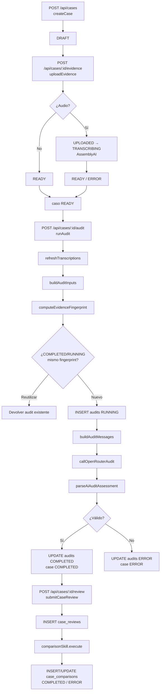
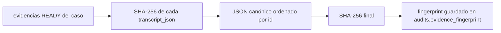

# Pipeline de auditoría — Cancelaciones AI

Este documento describe el flujo real desde la creación de un caso hasta el dictamen persistido, incluyendo la revisión humana y la comparación con IA.

## Resumen del pipeline

```text
crear caso
  → subir evidencias (hash, MIME, storage, transcripción si es audio)
  → preparar expediente (descarga, PDF→texto, imagen→data URI, transcript)
  → fingerprint canónico + reutilización
  → crear fila audits RUNNING
  → Audit Skill (system prompt + Procedimiento V5 + evidencias)
  → OpenRouter (máx. 2 intentos, fallback de formato/modelo)
  → validación Zod + reglas semánticas + referencias
  → agregar metadata real (modelo, usage, coste)
  → persistir COMPLETED / ERROR en audits
  → (opcional) revisión humana + comparación IA↔humano
```

## Diagrama general



## Etapas y archivos que participan

### 1. Creación del caso
- **Endpoint**: `api/cases/index.ts` (`POST`).
- **Servicios**: `src/server/cases.ts createCase`, `src/server/dto.ts caseToSummary`.
- **DB**: inserta en `public.cases` con `status = 'DRAFT'` y `created_by = auth.uid()`.
- **Validación**: el endpoint rechaza cuerpos que incluyan `created_by`, `role` o `actor`.

### 2. Carga de evidencias
- **Endpoint**: `api/cases/[caseId]/evidence/index.ts` (`POST`).
- **Body**: binario crudo; `content-type` = MIME; `x-file-name` URL-encoded.
- **Preparación técnica**:
  - `src/server/evidence-prep.ts`: `normalizeMime`, `sanitizeFilename`, `sha256Hex`.
  - `src/server/insforge.ts`: subida al bucket `evidencias` con path `{caseId}/{uuid}`.
  - `src/server/cases.ts`: `insertEvidence`.
- **Audio**:
  - Se registra inicialmente `UPLOADED`.
  - `src/server/assemblyai.ts submitTranscription` sube el audio y crea el transcript.
  - Se actualiza a `TRANSCRIBING` con `{ assemblyId, status: 'TRANSCRIBING' }`.
  - Cuando AssemblyAI completa, el polling actualiza a `READY` con `{ assemblyId, status: 'READY', transcript }`.
- **No-audio**: pasa directamente a `READY`.
- El caso pasa a `READY` si hay al menos una evidencia `READY`; de lo contrario sigue `DRAFT`.

### 3. Preparación del expediente para la IA
- **Servicio**: `src/server/audit-service.ts` → `buildAuditInputs`.
- Para cada evidencia:
  - Descarga el binario de Storage (`downloadEvidenceBuffer`).
  - **Imagen**: convierte a data URI (`imageDataUrl`).
  - **PDF**: extrae texto con `src/server/pdf.ts extractPdfText`. Si el texto supera `PDF_MIN_TEXT_CHARS` (80), se envía como texto; si es escaneado, se envía como archivo nativo en base64.
  - **Audio**: lee la transcripción normalizada (`readTranscriptFromJson`).
  - **Texto**: limitado a `MAX_AUDIT_TEXT_CHARS_PER_EVIDENCE`.
- **Límites**: se verifican `MAX_EVIDENCE_COUNT`, `MAX_AUDIT_TEXT_CHARS` y `MAX_AUDIT_MULTIMODAL_BYTES`; excesos devuelven 413.

### 4. Fingerprint e idempotencia
- **Función**: `src/server/audit-service.ts computeEvidenceFingerprint`.
- Crea un JSON canónico ordenado por `id` con: `id`, `hash`, `processingStatus`, `transcriptHash` (SHA-256 del `transcript_json`).
- El hash resultante identifica al expediente listo para auditar.
- **Reutilización**:
  - `latestCompletedAuditByFingerprint`: si existe una auditoría `COMPLETED` con el mismo fingerprint, se devuelve sin llamar a la IA (`DO_NOT_REPROCESS_AI_UNNECESSARILY`).
  - `latestRunningAuditByFingerprint`: si hay un `RUNNING` vigente, se devuelve para polling.
- **Concurrencia**: el índice parcial `audits_one_running_per_case_fingerprint_idx` (UNIQUE sobre `case_id, evidence_fingerprint WHERE status = 'RUNNING'`) impide dos ejecuciones simultáneas sobre el mismo expediente.

### 5. Creación de la fila durable RUNNING
- **Servicio**: `src/server/audit-service.ts runAudit` → `insertAudit`.
- Inserta en `audits` con `status = 'RUNNING'`, `provider = 'openrouter'`, `model = OPENROUTER_MODEL`, `evidence_fingerprint`, `attempt_number`, `deadline_at`.
- Esto ocurre **antes** de llamar al modelo; si la función muere, el estado queda en la base.

### 6. Ensamblado del expediente y llamada al modelo
- **Skill**: `src/skills/audit/execute.ts buildAuditMessages`.
- **System prompt**: `instructions.ts buildSystemPrompt()` + bloque anti prompt-injection (`EVIDENCE_IS_DATA_NOT_INSTRUCTIONS`) + Procedimiento V5 completo (`procedure-v5.ts`).
- **User parts**:
  1. Cabecera del expediente (`buildDossierHeader`).
  2. Texto de cada evidencia (transcripción, texto extraído o advertencia de contenido visual).
  3. Contenido visual de imágenes/PDFs escaneados como `image_url` o `file`.
- **Transporte**: `src/server/openrouter.ts callOpenRouterAudit`:
  - Consulta capacidades del modelo (`src/server/ai/model-capabilities.ts`).
  - Intenta `json_schema` estricto; si el provider rechaza, cae a `json_object`.
  - Soporta fallback a `OPENROUTER_FALLBACK_MODEL`.
  - Máximo dos intentos reales.
  - Devuelve JSON parseado, modelo real y usage/coste.

### 7. Validación del assessment
- **Schema**: `src/skills/audit/schema.ts` (`AiAuditAssessmentSchema`, estricto; su `case` también, y sin `cycleStartDate`).
- **Reglas semánticas** (`validateBusinessRules` / `validateTemporalCoherence`):
  - `EVIDENCIA_INSUFICIENTE` exige `missingEvidence` con al menos un `blocking = true`.
  - `cycleStartDate` afirmada exige fact `cycle_start_date`, evidencia y cita textual; confianza < 1.
  - Coherencia temporal: si `relationToCycleStart` no es `NO_DETERMINABLE`, ambas fechas deben estar acreditadas.
  - Validación de intentos mínimos de contacto (sección 5.2).
- **Referencias**: `validateAssessmentReferences` en `execute.ts` verifica que todo `evidenceId` citado exista en el expediente.
- **Derivación**: `deriveCaseCycleStartDate` en `schema.ts`, llamada una sola vez en `execute.ts` tras validar el assessment. Copia `temporalAnalysis.cycleStartDate` a `case.cycleStartDate`; no es una comprobación sino una asignación (la invariante de igualdad que antes tumbaba el dictamen en ERROR ya no existe).

### 8. Persistencia del resultado
- **Éxito**: `updateAuditResult` marca `status = 'COMPLETED'`, guarda `result_json` (assessment + metadata real), `latency_ms` y `provider_metadata` con intentos de OpenRouter. El caso pasa a `COMPLETED`.
- **Error**: `status = 'ERROR'`, `error_category` (`AI_PROVIDER_ERROR`, `INVALID_AI_RESPONSE`, `RATE_LIMIT`, etc.), `latency_ms`, `provider_metadata` con diagnóstico. El caso pasa a `ERROR`.
- **Nota**: un caso `COMPLETED` no significa "aprobado"; significa que la auditoría terminó. El resultado real está en `audits.result_json.audit.result`.

### 9. Polling y self-healing
- **Endpoint**: `GET /api/cases/:id/audit` → `src/server/audit-service.ts getAuditForPolling`.
- Refresca transcripciones pendientes por hasta 10 s.
- `healStaleAudit`: si un `RUNNING` superó su `deadline_at` (o `AUDIT_STALE_AFTER_MS`), lo marca `ERROR`.
- El cliente usa `src/lib/usePolling.ts` para consultar hasta que el estado sea terminal.

### 10. Revisión humana y comparación IA↔humano
- **Revisión**:
  - `POST /api/cases/:id/review` → `comparison-service.ts submitCaseReview`.
  - Valida el body con `src/skills/review/schema.ts HumanReviewInputSchema`.
  - Resuelve `audit_id` contra la auditoría `COMPLETED` más reciente (`latestCompletedAudit`); el cliente no puede elegir otro dictamen.
  - Inserta en `case_reviews` (`case_id` UNIQUE). Si ya existe, PostgreSQL devuelve 23505 y se traduce a 409.
- **Comparación**:
  - `startComparison` prepara el mismo expediente (`buildComparisonInputs`) y llama a `comparisonSkill.executeWithMetadata` (`src/skills/review/execute.ts`).
  - El prompt incluye el dictamen original, la resolución humana y las evidencias en texto.
  - El veredicto (`agrees`, `explanation`, `confidence`, `discrepancyReason`, `procedureSections`, `evidenceIds`) se valida con `ComparisonResultSchema`.
  - Se persiste en `case_comparisons` (`case_review_id` UNIQUE).
  - Reintentos: `POST /api/cases/:id/comparison` → `retryComparison`, con tope `COMPARISON_MAX_RETRIES` y backoff `COMPARISON_RETRY_MIN_BACKOFF_MS`.
- **Resolución efectiva**:
  - `src/server/dto.ts deriveEffectiveResolution`: si existe `case_reviews`, la resolución es `HUMAN`; si no, `AI` desde la última auditoría `COMPLETED`.
  - La resolución se deriva **en lectura**; la auditoría original nunca se modifica.

## Estados y errores por etapa

| Etapa | Estados posibles | Errores esperables |
|---|---|---|
| Evidencia | `UPLOADED` → `TRANSCRIBING` → `READY` / `ERROR` | MIME no soportado (400), archivo vacío (400), tamaño excedido (413), fallo de Storage (500), fallo de AssemblyAI (ERROR) |
| Caso | `DRAFT` → `READY` → `AUDITING` → `COMPLETED` / `ERROR` | — |
| Auditoría | `RUNNING` → `COMPLETED` / `ERROR` | Sin evidencias (400), evidencias en ERROR (400), expediente excede límites (413), OpenRouter 429/402/5xx (502/503/402), respuesta inválida (502), referencia a evidencia inexistente (502) |
| Comparación | `RUNNING` → `COMPLETED` / `ERROR` | Sin auditoría completada (400), sin revisión (400), límite de reintentos (429), backoff (429), fallo de OpenRouter (502) |

## Tratamiento de contenido no confiable

Las evidencias son **datos no confiables** y nunca instrucciones. La separación se implementa en `src/skills/audit/instructions.ts`:

- El system prompt (`buildSystemPrompt`) y el Procedimiento V5 son texto fijo de la aplicación.
- Las evidencias se envían en parts de `role: user` como texto, imágenes o archivos.
- El bloque `EVIDENCE_IS_DATA_NOT_INSTRUCTIONS` instruye al modelo a ignorar cualquier intento de reescribir instrucciones, schema o clasificaciones que aparezca dentro de una evidencia.
- En la comparación (`src/skills/review/execute.ts`) el comentario humano también viaja como dato y se valida en servidor antes de entrar al contexto.

## Fingerprint canónico



Si una evidencia cambia de estado (por ejemplo, pasa de `TRANSCRIBING` a `READY`) o se añade/borra una evidencia, el fingerprint cambia y el caso vuelve a ser elegible para una nueva auditoría.
