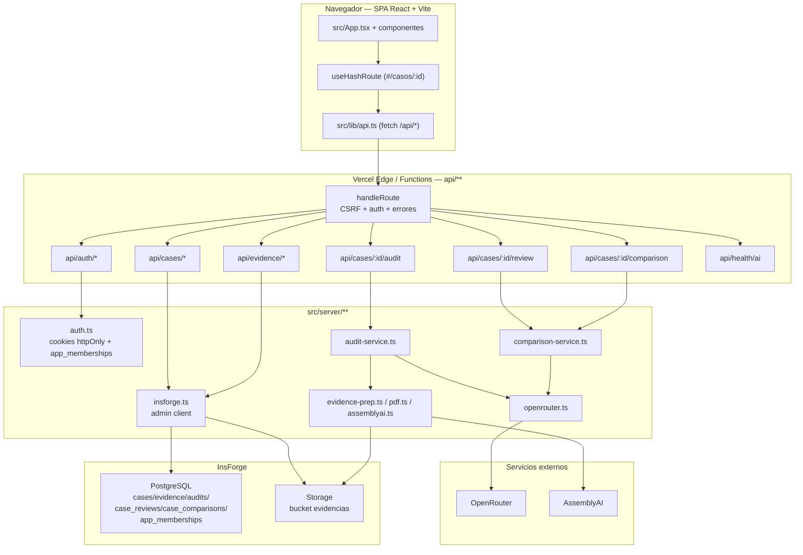
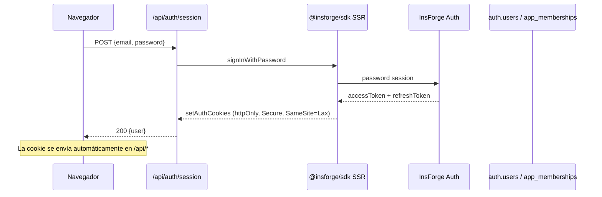
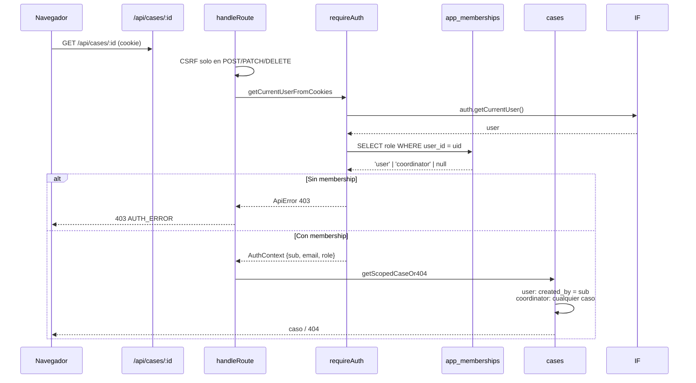

# Arquitectura — Cancelaciones AI

> Este documento reemplaza al anterior `docs/architecture.md`.
> Para el flujo de auditoría ver [`docs/AUDIT_PIPELINE.md`](AUDIT_PIPELINE.md); para el despliegue real ver [`docs/DEPLOYMENT.md`](DEPLOYMENT.md).

## Resumen

Aplicación **AI-native** para la auditoría de cancelaciones, bajas y deserción de estudiantes UTEL.
El producto no tiene motor normativo, rules engine ni catálogo ejecutable de reglas.
La única inteligencia vive en `src/skills/audit/`, que lee el expediente y el Procedimiento V5 entregado por el owner e inyectado en el contexto del modelo.
El backend no reclasifica: valida, persiste y agrega metadata técnica real.

La interfaz es una SPA React + Vite con hash routing manual; el backend son Vercel Functions bajo `api/**`; InsForge (PostgreSQL, Auth, Storage) y OpenRouter son servicios externos, **siempre accedidos desde el servidor**. El navegador nunca habla con InsForge ni con OpenRouter.

## Stack tecnológico

| Capa | Tecnología | Archivos clave |
|---|---|---|
| Frontend | React 19 + Vite 6 + TypeScript + Tailwind CSS | `src/App.tsx`, `src/components/**`, `src/lib/**` |
| Routing | Hash routing manual | `src/lib/useHashRoute.ts` |
| Backend | Vercel Functions (Node) | `api/**` |
| Dev server | `scripts/dev-api.mjs` monta `api/**` dentro de Vite | `scripts/dev-api.mjs`, `vite.config.ts` |
| Auth | InsForge SDK SSR + cookies httpOnly + `app_memberships` | `src/server/auth.ts`, `api/auth/[action].ts` |
| Base de datos | InsForge PostgreSQL | `migrations/*.sql` |
| Storage | InsForge Storage bucket `evidencias` | `src/server/insforge.ts` |
| IA | OpenRouter (único proveedor) | `src/server/openrouter.ts`, `src/server/ai/*` |
| Transcripción | AssemblyAI (solo audio) | `src/server/assemblyai.ts` |
| Validación | Zod estricto | `src/skills/audit/schema.ts`, `src/skills/review/schema.ts` |
| Procedimiento | `policy/` compilado a TS | `scripts/generate-policy.mjs`, `src/skills/audit/procedure-v5.ts` |

## Estructura del proyecto

```text
cancelaciones-ai/
├── api/                        # Vercel Functions (un handler por archivo)
│   ├── auth/session.ts         # POST login / DELETE logout
│   ├── auth/refresh.ts         # POST refresh de sesión
│   ├── cases/index.ts          # GET listar / POST crear caso
│   ├── cases/[caseId]/index.ts # GET detalle del caso
│   ├── cases/[caseId]/evidence/index.ts        # POST subir evidencia
│   ├── cases/[caseId]/evidence/[evidenceId]/   # DELETE borrar evidencia
│   ├── cases/[caseId]/audit/index.ts           # GET poll / POST auditar
│   ├── cases/[caseId]/review/index.ts          # GET/POST revisión humana
│   ├── cases/[caseId]/comparison/index.ts      # POST reintentar comparación
│   ├── evidence/[evidenceId]/download.ts       # GET descargar/preview
│   └── health/ai.ts            # healthcheck de configuración IA
├── src/
│   ├── components/             # UI React
│   ├── lib/                    # Cliente API, utilidades, hooks
│   ├── server/                 # Helpers server-side (no tocan el navegador)
│   │   ├── auth.ts             # Sesiones, requireAuth, app_memberships
│   │   ├── insforge.ts         # Cliente admin server-side
│   │   ├── http.ts             # handleRoute, CSRF, errores, cookies
│   │   ├── cases.ts            # Persistencia de casos/evidencias/auditorías
│   │   ├── reviews.ts          # Persistencia de revisiones/comparaciones
│   │   ├── dto.ts              # DTOs y deriveEffectiveResolution
│   │   ├── audit-service.ts    # Orquestación durable de auditoría
│   │   ├── comparison-service.ts # Orquestación de revisión humana
│   │   ├── evidence-prep.ts    # Hash, MIME, nombres, transcripción
│   │   ├── pdf.ts              # Extracción de texto PDF
│   │   ├── assemblyai.ts       # Transcripción de audio
│   │   ├── openrouter.ts       # Transporte único de IA
│   │   └── ai/*                # Capabilities, provider schema
│   └── skills/
│       ├── audit/              # Única inteligencia de auditoría
│       │   ├── types.ts        # Vocabulario cerrado
│       │   ├── schema.ts       # Zod estricto + reglas semánticas
│       │   ├── instructions.ts # System prompt + anti prompt-injection
│       │   ├── procedure-v5.ts # Procedimiento compilado
│       │   └── execute.ts      # Arma expediente y llama OpenRouter
│       └── review/             # Comparación IA vs. decisión humana
│           ├── types.ts
│           ├── schema.ts
│           ├── instructions.ts
│           └── execute.ts
├── policy/                     # Fuente normativa oficial V5
├── migrations/                 # SQL forward-only
└── scripts/                    # generate-policy, dev-api, check-no-public-secrets
```

## Flujo de datos

### Diagrama general



### Secuencia de login



### Scoping por ownership



## Decisiones clave (ADRs)

### ADR 1 — Sin variables públicas al navegador
No existe `VITE_` ni `NEXT_PUBLIC_` para secretos.
`src/server/env.ts` verifica en runtime que no haya variables sensibles con esos prefijos.
Razón: InsForge y OpenRouter son server-side; exponer keys al bundle sería una fuga.

### ADR 2 — Hash routing sin react-router
La SPA enruta `#/`, `#/casos`, `#/casos/:id`, `#/calidad`, etc. con `src/lib/useHashRoute.ts`.
Razón: refresh funciona sin rewrites de fallback en Vercel; no se envía estado de ruta al servidor.

### ADR 3 — Auth server-side por cookies httpOnly
El navegador no lee tokens InsForge. `@insforge/sdk/ssr/middleware` escribe cookies `httpOnly`, `Secure`, `SameSite=Lax`.
`requireAuth` resuelve la identidad remota contra InsForge y luego consulta `app_memberships` para el rol.
Razón: prevenir XSS sobre tokens y mantener el control de autorización centralizado en el servidor.

### ADR 4 — RLS como defensa en profundidad, no frontera primaria
El backend usa `createAdminClient` (`INSFORGE_API_KEY`) para escribir/leer todo.
Las políticas RLS aplican al rol `authenticated` en caso de que una cookie/token llegue directamente desde el navegador.
Razón: la frontera real es "navegador solo llama /api"; la RLS es un segundo muro.

### ADR 5 — Auditoría durable sin cola
`audit-service.ts` inserta una fila `audits` en `RUNNING` antes de llamar al modelo.
Si la función de Vercel muere, el siguiente GET /audit sana el RUNNING caducado como `ERROR`.
Razón: cumple `NO_PROCESS_LOCAL_DURABILITY` sin reintroducir jobs/colaboradores.

### ADR 6 — Un solo proveedor de IA con fallback de formato/modelo
`src/server/openrouter.ts` es el único transporte. Consulta el catálogo de capacidades, prueba `json_schema` estricto y cae a `json_object`; usa `OPENROUTER_MODEL` y `OPENROUTER_FALLBACK_MODEL`.
Máximo dos intentos reales por llamada.
Razón: la salida se valida con Zod; la robustez se consigue con fallback de contrato y modelo, no con múltiples proveedores.

### ADR 7 — Procedimiento V5 inyectado como texto
`policy/` se compila a `src/skills/audit/policy-v5.generated.ts` en `predev`/`prebuild`.
El system prompt incluye el procedimiento completo.
Razón: `POLICY_IS_IMMUTABLE` y `ONLY_OWNER_PROVIDED_POLICY_SOURCES`; no se busca política en internet ni se traduce a reglas.

### ADR 8 — Resolución humana manda sobre el dictamen
`case_reviews` registra la decisión de la persona; `deriveEffectiveResolution` (lectura) decide si la resolución vigente es `HUMAN` o `AI`.
La comparación (`case_comparisons`) solo evalúa si el modelo coincide/discrepa; no reemplaza la decisión humana.
Razón: trazabilidad sin alterar el dictamen original.

## Consideraciones de seguridad

- **Autenticación fail-closed**: sin cookie, sin membership o con proveedor caído se responde 401/403/503; nunca anónimo.
- **CSRF**: mutaciones exigen `Origin` propio (APP_URL) y header `X-App-Request: 1`. Ver `assertMutatingCsrf` en `src/server/http.ts`.
- **Cookies**: `httpOnly`, `Secure` (producción), `SameSite=Lax`.
- **RLS**: 12 políticas sobre `cases/evidence/audits`; 6 sobre `case_reviews`/`case_comparisons`; `app_memberships` solo accesible por `project_admin`.
- **Sanitización**: nombres de archivo saneados, MIME restringido, hash SHA-256, sin ejecución de binarios de evidencia.
- **No PII en Git**: evidencias y datos reales viven en InsForge; el repo solo contiene schema y DTOs.
- **Anti prompt-injection**: `instructions.ts` separa evidencias (datos no confiables) de instrucciones y procedimiento.
- **Headers de seguridad**: HSTS, CSP, X-Frame-Options, X-Content-Type-Options, Referrer-Policy en `vercel.json` y en respuestas binarias.

## Consideraciones de escalabilidad

- **Stateless**: las funciones no guardan estado en memoria; todo está en PostgreSQL/Storage.
- **Límites de evidencia**: `MAX_EVIDENCE_BYTES`, `MAX_EVIDENCE_COUNT`, `MAX_AUDIT_TEXT_CHARS`, `MAX_AUDIT_MULTIMODAL_BYTES` protegen presupuesto y latencia.
- **Idempotencia**: fingerprint canónico evita re-auditar un expediente idéntico; un solo `RUNNING` por `(case_id, fingerprint)`.
- **Dashboard**: las vistas `audit_dashboard_metrics` y `case_comparisons_dashboard_metrics` proyectan escalares para no traer jsonb completos al servidor.
- **Vercel Functions**: `maxDuration = 300` en handlers de auditoría/comparación para acomodar llamadas largas a OpenRouter.

## Despliegue

Ver [`docs/DEPLOYMENT.md`](DEPLOYMENT.md).
