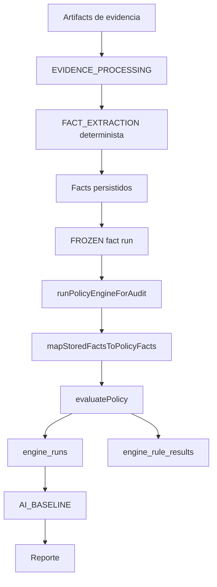
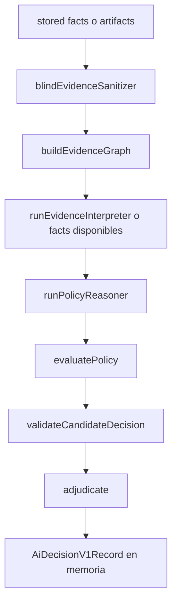
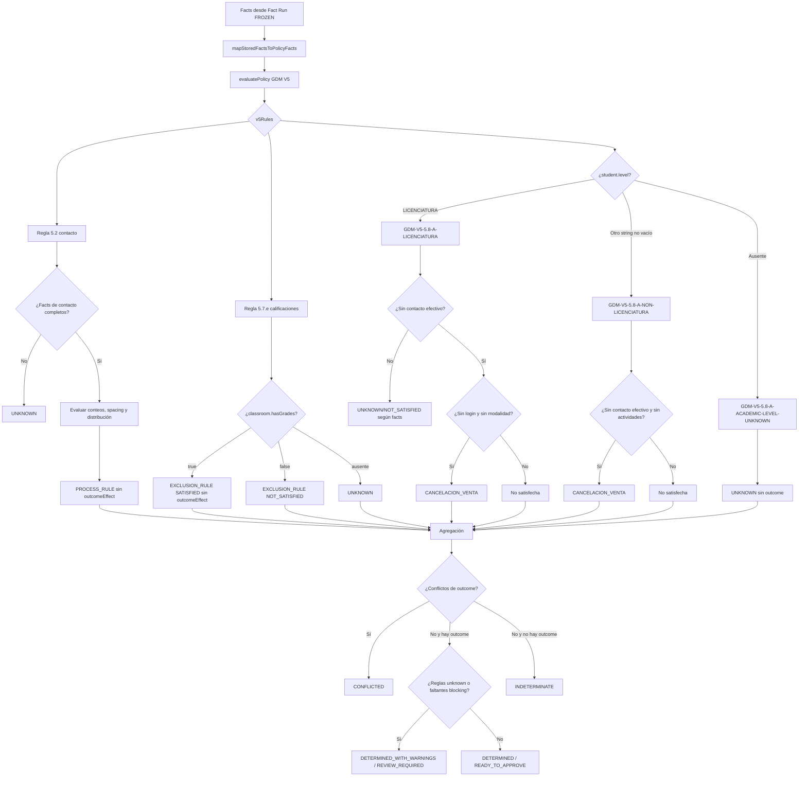
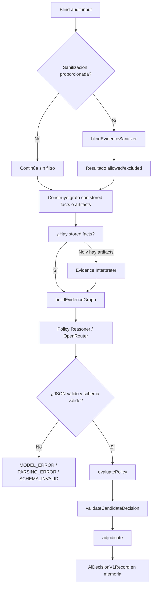

# Rule Engine Refactor Assessment

## 1. Executive Summary

La auditoría del código real muestra que el producto no tiene todavía un único Rule Engine híbrido integrado. El flujo productivo activo es:

```text
Artifacts de evidencia
  -> extracción determinista de facts
  -> Fact Run FROZEN
  -> runPolicyEngineForAudit
  -> evaluatePolicy
  -> engine_runs + engine_rule_results
  -> AI_BASELINE
  -> reporte
```

El motor puro de `packages/policy-engine` es pequeño, síncrono y mayormente determinista, pero sólo implementa una parte de GDM V5. La ruta paralela `blind-audit.ts` incorpora Evidence Interpreter, Policy Reasoner, Validator y Adjudicator, pero no tiene consumidores productivos detectados y no persiste `AI_DECISION_V1`.

Conclusiones principales:

- Hay tres identificadores de regla activos para V5: 5.2, 5.7.e y una rama de 5.8.a.
- `GDM-V5-5.2-A-CONTACT-ATTEMPTS` es una aproximación parcial: no implementa la ventana temporal, fecha de inicio, horarios distintos ni todas las condiciones de 5.2.
- `GDM-V5-5.7-E-INITIAL-BIMESTER-GRADES` se representa como exclusión, pero no asigna el efecto `BAJA`; por tanto, el agregador actual no garantiza que esa regla impida un outcome de cancelación de venta.
- `GDM-V5-5.8-A-*` es una simplificación de 5.8.a y carece de varias condiciones normativas y subcategorías de nivel.
- La versión `2` no tiene implementación normativa independiente: se genera reetiquetando las reglas V5.
- El motor puro no es quien decide mediante IA en el flujo productivo. La IA no está conectada al pipeline principal.
- La arquitectura híbrida declarada en documentación excede la implementación conectada y contiene riesgos de sanitización, provenance, validación de evidencia, estados y persistencia.
- `AI_DECISION_V1` es actualmente una estructura temporal en memoria. No existe evidencia de inmutabilidad durable completa.
- Los 12 `softwareCoverageGaps` de V5 están hardcodeados. Esto es útil como señal explícita, pero no equivale a cobertura normativa completa.
- Los tests actuales cubren escenario parciales y, en el caso blind principal, aceptan un fallo controlado antes de verificar el camino exitoso. No se ejecutaron durante esta auditoría.

La migración a reglas declarativas es conceptualmente viable para las reglas actualmente activas, pero no es segura hasta corregir o decidir explícitamente las divergencias funcionales, construir un Golden Master, proteger decisiones persistidas y separar claramente estados de evidencia, policy, sistema, decisión y revisión.

## 2. Current Architecture

### 2.1 Componentes principales

| Componente | Ubicación | Responsabilidad | Estado real |
|---|---|---|---|
| Policy Engine puro | `packages/policy-engine/src/index.ts` | Evalúa facts contra reglas hardcodeadas y agrega outcomes | Activo, parcial |
| Comparación formal | `packages/policy-engine/src/comparison.ts` | Compara outcome machine con resolución humana | Activo |
| Adjudicator/validator | `packages/policy-engine/src/adjudication.ts` | Valida candidatos IA, calcula confianza y produce estado híbrido | No conectado al flujo principal |
| Integración de persistencia | `apps/web/src/server/policy/evaluation.ts` | Lee facts/revisiones, ejecuta motor, persiste resultados | Activo |
| Fact freeze/mapping | `apps/web/src/server/policy/frozen-fact-run.ts` | Valida run congelado y adapta facts almacenados | Activo |
| Evidence graph | `apps/web/src/server/policy/evidence-graph.ts` | Detecta conflictos y normaliza colecciones | Implementado, usado sólo en blind audit |
| Evidence Interpreter | `apps/web/src/server/policy/evidence-interpreter.ts` | Extrae candidatos desde stored facts/artifacts | Implementado parcialmente, no usa LLM real |
| Blind sanitizer | `apps/web/src/server/policy/blind-evidence-sanitizer.ts` | Detecta roles y heurísticas de contenido humano | Implementado, aplicación posterior incompleta |
| Policy Reasoner | `apps/web/src/server/policy/reasoner.ts` | Produce candidate decision mediante OpenRouter | Implementado, no conectado al pipeline principal |
| Blind audit | `apps/web/src/server/policy/blind-audit.ts` | Orquesta interpreter, reasoner, engine, validator y adjudicator | Implementado, sin persistencia productiva |
| Rule governance DB | `migrations/20260924220000_mc-f2-003-evidence-requirements.sql` | Catálogo versionado de reglas y requisitos | Metadata; no es intérprete ejecutable |
| AI/human runs | `migrations/20260924120000_ai-human-comparison.sql` | Ledger de runs, comparisons y adjudications | Persistencia parcial; actualización permitida |
| Reconciliation | `apps/web/src/server/reconciliation/service.ts` | Analiza discrepancias con análisis determinista y enriquecimiento LLM | Activo, con riesgos de snapshot/contexto |

### 2.2 Arquitectura documentada frente a arquitectura real

La documentación describe una cadena RAW ARTIFACTS -> Evidence Interpreter -> Frozen Fact Run -> Policy Engine -> Machine Decision -> Human Comparison/Adjudication.

La implementación activa es:



La ruta híbrida es paralela:



No se detectó una llamada productiva a `runBlindMachineAudit`. El endpoint principal `apps/web/src/app/api/audits/[auditId]/policy/route.ts:43-57` llama únicamente a `runPolicyEngineForAudit`. El job `apps/web/src/server/jobs/handlers.ts:192-199` también llama únicamente al motor determinista.

### 2.3 Separación de responsabilidades

La separación conceptual es correcta en el motor puro: `packages/policy-engine` no importa React, Next.js, InsForge, OpenRouter, filesystem ni HTTP. Sin embargo, la separación se rompe en la arquitectura híbrida porque el prompt contiene referencias normativas y el Reasoner puede proponer un outcome antes de la validación formal. La validación existe como barrera, pero no está conectada al resultado productivo y no valida completamente evidencia, sección, versión ni soporte positivo.

## 3. Actual Decision Flow

### 3.1 Flujo de hechos del pipeline productivo

1. `EVIDENCE_PROCESSING` procesa evidencia y produce `job_artifacts`.
2. `FACT_EXTRACTION` usa `listBaselineArtifactsByAudit`, filtrando evidencias con rol `EVIDENCE`.
3. `extractFactsFromArtifacts` normaliza contactos y extrae facts mediante regex y valores de artifacts.
4. Se insertan facts y el run se marca `FROZEN`.
5. `runPolicyEngineForAudit` valida que el run exista, pertenezca a la auditoría y corresponda a policy code/version.
6. Lee todas las revisiones humanas de `fact_reviews` asociadas al `auditId`.
7. Excluye facts con review `INVALID` y sustituye valores por `corrected_value` cuando existe.
8. Mapea los facts a `Fact[]`.
9. Ejecuta `evaluatePolicy`.
10. Persiste `engine_runs`, `engine_rule_results` y registra baseline.

El paso 7 es importante: la revisión humana posterior puede cambiar los facts efectivos usados para evaluar un run declarado congelado. La revisión no está asociada a `fact_run_id` ni a `engine_run_id`.

### 3.2 Flujo de decisión V5

`evaluatePolicy` busca el policy set:

```text
GDM_GAM_PRD_MLG_003 -> 5 -> v5Rules
```

`v5Rules` siempre devuelve:

- Una regla de proceso de contacto.
- Una regla de exclusión de calificaciones iniciales.
- Una única regla de outcome 5.8 según nivel académico.

La agregación sólo considera reglas `SATISFIED` de categoría `OUTCOME_RULE` con `outcomeEffect`. Las reglas `PROCESS_RULE` y `EXCLUSION_RULE` no aportan outcome por sí solas.

### 3.3 Reglas de contacto

La regla `GDM-V5-5.2-A-CONTACT-ATTEMPTS` evalúa:

- Al menos 16 llamadas observadas.
- Al menos 16 grupos de llamadas separados por seis horas o más.
- Al menos seis interacciones escritas observadas.
- Distribución de interacciones escritas 70/30 entre dos semanas.
- `sourceCompleteness === COMPLETE`; si no, las condiciones correspondientes quedan `UNKNOWN`.

No evalúa `student.startDate`, ventana de dos semanas, dos llamadas diarias, horarios distintos ni las reglas adicionales de 5.2.

### 3.4 Regla de calificaciones

`GDM-V5-5.7-E-INITIAL-BIMESTER-GRADES` produce:

- `TRUE` si `classroom.hasGrades === true`.
- `FALSE` si `classroom.hasGrades === false`.
- `UNKNOWN` si falta.

Es `EXCLUSION_RULE`, no `OUTCOME_RULE`, y no contiene `outcomeEffect: 'BAJA'`. La documentación y el inventario normativo indican una exclusión de cancelación de venta y una consideración de baja por devengamiento, pero el código actual no expresa ese efecto en la agregación.

### 3.5 Regla 5.8.a y ramas

La regla de outcome se selecciona así:

| Valor de `student.level` | Rule ID | Condiciones adicionales |
|---|---|---|
| `LICENCIATURA` | `GDM-V5-5.8-A-LICENCIATURA` | `contact.effectiveContact === false`, `classroom.hasLogin === false`, `classroom.hasEvaluationMode === false` |
| Otro string no vacío | `GDM-V5-5.8-A-NON-LICENCIATURA` | `contact.effectiveContact === false`, `classroom.hasActivities === false` |
| Ausente | `GDM-V5-5.8-A-ACADEMIC-LEVEL-UNKNOWN` | Resultado `UNKNOWN`, sin outcome |

Cualquier string no vacío distinto de `LICENCIATURA` se clasifica como no licenciatura. No existe una rama específica para las categorías normativas que distinguen el nivel dentro de 5.8.a.

### 3.6 Agregación

Después de evaluar:

1. Se seleccionan reglas `SATISFIED`.
2. Se seleccionan únicamente `OUTCOME_RULE` con `outcomeEffect`.
3. Se eliminan duplicados de outcome.
4. Más de un outcome produce `CONFLICTED`.
5. Un outcome produce `suggestedOutcome`.
6. Sin outcome produce `INDETERMINATE`.
7. `UNKNOWN`, conflictos o faltantes pueden convertir un outcome en `REVIEW_REQUIRED` o `DETERMINED_WITH_WARNINGS`.

`ownerPrecedences` se acepta en la firma, pero no se usa. `softwareCoverageGaps` tampoco participa en `requiresReview`, pese a que la documentación indica que debería impedir `READY_TO_APPROVE`.

## 4. GDM Rule Inventory

### 4.1 Reglas activas en el evaluador

| Rule ID | Sección GDM | Archivo | Función | Inputs | Condición | Resultado | Tests | Estado |
|---|---|---|---|---|---|---|---|---|
| `GDM-V5-5.2-A-CONTACT-ATTEMPTS` | 5.2, página codificada 3 | `packages/policy-engine/src/index.ts:152-169` | `v5Rules` | `contact.callAttempts`, `contact.writtenInteractions` | Completeness completa; conteos 16/16/6; spacing seis horas; distribución 70/30 | Regla de proceso; sin `outcomeEffect` | `index.test.ts` cubre conteo, completeness parcial y distribución con `WRITTEN` | `PARTIAL` |
| `GDM-V5-5.7-E-INITIAL-BIMESTER-GRADES` | 5.7.e, página codificada 9 | `packages/policy-engine/src/index.ts:170-172` | `v5Rules` | `classroom.hasGrades` | `hasGrades === true` | Exclusión; no agrega `BAJA` al outcome | Se verifica existencia de la regla, no efecto sobre outcome | `PARTIAL` |
| `GDM-V5-5.8-A-LICENCIATURA` | 5.8.a, página codificada 9 | `packages/policy-engine/src/index.ts:173-197` | rama de nivel | `student.level`, `contact.effectiveContact`, `classroom.hasLogin`, `classroom.hasEvaluationMode` | Nivel licenciatura, sin contacto efectivo, sin login, sin modalidad | `CANCELACION_VENTA` si todas son true | `index.test.ts` cubre rama y condiciones | `PARTIAL` |
| `GDM-V5-5.8-A-NON-LICENCIATURA` | 5.8.a, página codificada 9 | `packages/policy-engine/src/index.ts:173-197` | rama de nivel | `student.level`, `contact.effectiveContact`, `classroom.hasActivities` | Nivel no licenciatura, sin contacto efectivo, sin actividades | `CANCELACION_VENTA` si todas son true | `index.test.ts` cubre rama | `PARTIAL` |
| `GDM-V5-5.8-A-ACADEMIC-LEVEL-UNKNOWN` | 5.8.a | `packages/policy-engine/src/index.ts:173-197` | rama de nivel | `student.level` ausente | Nivel no identificado | `UNKNOWN`, sin outcome | `index.test.ts` cubre rama | `PARTIAL` |

La cantidad de Rule IDs activos es cinco, aunque sólo se materializa una de las tres ramas de nivel por evaluación. Las reglas de proceso y exclusión se evalúan siempre.

### 4.2 Reglas de governance que no ejecutan reglas

La migración `20260924220000_mc-f2-003-evidence-requirements.sql` define:

- `rules`
- `rule_conditions`
- `evidence_requirements`

`rule_conditions` contiene `fact_type`, `operator`, `expected_value`, `required` y `order_index`, pero no existe intérprete de operadores, no hay lectura desde `evaluatePolicy` y no hay API de CRUD para condiciones. Es un catálogo de governance, no una segunda implementación del motor.

### 4.3 Reglas candidata no implementadas

La documentación contiene IDs históricos o candidatos para otras secciones. No son reglas activas del evaluador actual.

| Rule ID o referencia | Sección | Estado |
|---|---:|---|
| `GDM-5.1-B-001` | 5.1.b | `AMBIGUOUS`; cálculo de horas no definido en la fuente usada |
| `GDM-5.1-D-001` | 5.1.d | `COVERAGE_GAP` |
| `GDM-5.2-B-001` | 5.2.b | Referencia histórica; no coincide con la regla V5 activa |
| `GDM-5.3-A-I-001` | 5.3.a.I | `COVERAGE_GAP` |
| `GDM-5.3-A-II-001` | 5.3.a.II | `AMBIGUOUS` |
| `GDM-5.3-A-III-001` | 5.3.a.III | `UNSUPPORTED`; fuentes dependientes faltantes |
| `GDM-5.3-C-001` | 5.3.c | `COVERAGE_GAP` |
| `GDM-5.4-A-001` | 5.4.a | `UNSUPPORTED`; fuente normativa dependiente no suministrada |
| `GDM-5.5-A-001` | 5.5.a | `AMBIGUOUS` |
| `GDM-5.6-A-001` | 5.6.a | `COVERAGE_GAP` |
| `GDM-5.7-D-001` | 5.7.d | Referencia histórica; no está implementada en V5 |
| `GDM-5.8-A-001` | 5.8.a | Referencia histórica; la implementación V5 usa IDs distintos |
| `GDM-5.8-G-001` | 5.8.g | `COVERAGE_GAP` |
| `GDM-5.9-A-001` | 5.9.a | `UNSUPPORTED`; fuentes Decision 35/53 faltantes |
| `GDM-5.10-A-001` | 5.10.a | `COVERAGE_GAP` |
| `GDM-5.12-A-001` | 5.12 | `COVERAGE_GAP` |

No se inventan nuevos IDs para secciones sin ID oficial/local.

## 5. Decision Tree Map

### 5.1 Árbol productivo real



### 5.2 Árbol de decisión híbrida



La rama de sanitización no debe cambiar la decisión normativa por sí misma; debe ser un control previo de entrada del grafo. Actualmente ese control no está aplicado de extremo a extremo.

## 6. Hardcoded Logic Inventory

| Fragmento | Archivo y líneas aproximadas | Regla relacionada | Complejidad | Dependencias | Clasificación |
|---|---|---|---|---|---|
| `stateToRule` | `packages/policy-engine/src/index.ts:110-114` | Agregación de estados | Baja | Arrays de condiciones | `DECLARATIVE_CANDIDATE` sólo como parte de schema; conviene conservar como runtime común |
| `isBusinessDay` | `index.ts:116` | Posible cálculo temporal | Baja | `Date` UTC | `KEEP_AS_CODE` hasta confirmar uso normativo |
| `businessDaysBetween` | `index.ts:117-122` | Posible cálculo temporal | Media | `Date`, loop | `KEEP_AS_CODE` o custom operator versionado |
| `countValidCalls` | `index.ts:124-126` | 5.2 | Baja | Tipo `ContactAttempt` | `KEEP_AS_CODE` o `REQUIRES_CUSTOM_OPERATOR` |
| `collectionValue` | `index.ts:127-139` | 5.2 | Media | Shape de collections | `KEEP_AS_CODE`; normalización de datos |
| `groupCalls` | `index.ts:140-145` | 5.2 | Media | Sorting y diferencia temporal | `REQUIRES_CUSTOM_OPERATOR` |
| `calculateInteractionDistribution` | `index.ts:146-150` | 5.2 | Media | Eventos `WRITTEN`, fechas y ratio 70/30 | `REQUIRES_CUSTOM_OPERATOR` |
| Ramas de nivel 5.8 | `index.ts:173-197` | 5.8.a | Alta | Selección de nivel y facts específicos | `MOSTLY_DECLARATIVE` sólo después de formalizar faithfully |
| Agregación de outcomes | `index.ts:209-260` | Todas | Alta | Outcomes, conflictos, missing facts | `KEEP_AS_CODE`; la política de agregación no debería quedar en archivos de reglas |
| Lista de coverage gaps | `index.ts:227-241` | V5 | Baja | Strings hardcodeados | `NEEDS_REVIEW`; puede ser catálogo declarative, pero no fuente normativa |
| Normalización de contacto | `apps/web/src/server/facts/extract.ts:36-115` | Facts de 5.2/5.8 | Alta | Regex, artifacts, canales | `KEEP_AS_CODE`; extracción/normalización |
| Regex de Evidence Interpreter | `apps/web/src/server/policy/evidence-interpreter.ts:6-65` | Extracción | Media | Texto de artifacts | `KEEP_AS_CODE`; no es una regla del Policy Engine |
| Fusión de colecciones | `apps/web/src/server/policy/evidence-graph.ts:61-89` | Facts de contacto | Media | Deduplicación y completeness | `KEEP_AS_CODE` |
| Resolución de conflictos por confianza/fecha | `evidence-graph.ts:127-143` | Normalización | Media | Confidence, `createdAt` | `NEEDS_REVIEW`; no equivale a una regla normativa |
| Prompt normativo | `apps/web/src/server/policy/prompts/policy-reasoner/v1/prompt.ts:17-31` | Separación IA/Policy | Media | Outcomes y reglas esperadas | `NEEDS_REVIEW`; no contiene la política completa, pero sí enumera outcomes y exige reglas |
| Confianza híbrida | `packages/policy-engine/src/adjudication.ts:126-191` | Adjudication | Media | cinco componentes | `KEEP_AS_CODE`; no es una regla normativa |
| Normalización de resolución humana | `packages/policy-engine/src/comparison.ts:30-59` | Comparación | Media | Strings humanos | `KEEP_AS_CODE` |

No se debe convertir en declarative una condición si su implementación actual mezcla interpretación, normalización o política no explicitada. La primera migración debe separar datos normativos de funciones de infraestructura.

## 7. Duplicate Logic

### 7.1 Comparación duplicada

Existen tres capacidades distintas:

1. `compareHistoricalOutcome` en `packages/policy-engine/src/index.ts`.
2. `compareHumanDecisionWithBaseline` en `packages/policy-engine/src/comparison.ts`.
3. `compareBlindAuditWithHuman` en `apps/web/src/server/policy/comparison-blind.ts`.

La tercera compara strings sin normalizar. La segunda normaliza expresiones humanas. La primera sólo compara el outcome ya extraído. Esto puede producir resultados divergentes para la misma decisión humana.

### 7.2 Mapeo de facts

- `mapStoredFactsToPolicyFacts` adapta facts a `Fact[]`.
- `buildEvidenceGraph` también resuelve facts y detecta conflictos.
- `runEvidenceInterpreter` genera candidatos y los convierte en facts en otra función no conectada.

El pipeline productivo usa el mapper directo, mientras blind audit usa el grafo. La misma evidencia puede entrar por dos rutas con resolutions diferentes.

### 7.3 Condiciones de contacto

La condición de separación de seis horas está en `groupCalls`. El extractor también deduplica eventos por `kind`, fecha y status. La distribución 70/30 sólo cuenta `kind === WRITTEN`, aunque el extractor genera `EMAIL`, `WHATSAPP` y `OTHER_WRITTEN`. Esto puede hacer que el conteo y la distribución observen conjuntos diferentes.

### 7.4 Estado de decisión

`PolicyEvaluation.decisionStatus`, `engine_runs.decision_status` y `outcome_status` representan estados diferentes, pero el insert productivo no escribe `decision_status`. La DB puede quedar en `INDETERMINATE` por default aunque el JSON indique `READY_TO_APPROVE` o `REVIEW_REQUIRED`.

### 7.5 Listeners de rules

La tabla de governance contiene `operator` y `expected_value`, pero no hay consumidor. Mantener esa estructura sin intérprete puede crear la impresión de que existe un segundo motor.

## 8. Determinism & Side Effects

### 8.1 Motor puro

`evaluatePolicy` no accede a DB, red, LLM, filesystem, variables de entorno, random ni estado global. La entrada relevante es `policyCode`, `policyVersion` y `facts`. Esto cumple parcialmente:

```text
same facts + same policy version = same decision
```

La misma entrada produce el mismo resultado, salvo dependencias de orden externo o datos no deterministas en facts y normalización.

Dependencias del motor puro:

| Dependencia | Tipo | Evaluación |
|---|---|---|
| `Date` | Dependencia temporal controlled | Sólo mediante fechas suministradas; no se obtiene `now()` dentro de `evaluatePolicy` |
| `stableFingerprint` | Utilidad determinista | Dependencia de `@cancelaciones/domain` |
| Orden de facts | Semántica de entrada | Puede afectar resolución indirecta en adapters que toman el primer registro |
| `ownerPrecedences` | Parámetro declarado | Ignorado actualmente; no afecta resultado |
| DB | Ausente del package puro | Presente en adapter de aplicación |
| OpenRouter | Ausente del package puro | Presente en reasoner |
| Network | Ausente del package puro | Presente en workflow de aplicación |
| Random | Ausente del package puro | Presente en `crypto.randomUUID()` de una función no usada del interpreter |
| Global state | No se observa en `evaluatePolicy` | El resto de la aplicación sí tiene estado durable externo |

### 8.2 Integración de aplicación

`runPolicyEngineForAudit` depende de:

- DB de auditoría.
- Repositorio de fact runs.
- Facts persistidos.
- `fact_reviews`.
- `engine_runs` y `engine_rule_results`.
- `recordBaselineRun`.
- Fingerprints y orden de las filas devueltas.

El resultado estática del motor puro es determinista, pero la entrada efectiva usada en DB puede cambiar por revisiones humanas.

### 8.3 Blind audit

`runBlindMachineAudit` introduce:

- `new Date().toISOString()`.
- `Date.now()` en IDs sintéticos.
- Ordering de facts.
- Candidate fetcher opcional.
- `runPolicyReasoner` y OpenRouter.
- Posible fallback de artifacts.
- Posible ejecución del validator/adjudicator.

El `inputFingerprint` en modo artifacts puede variar por `Date.now()` y `createdAt`, aunque el contenido de entrada sea equivalente.

### 8.4 Side effects de persistencia

El motor puro no persiste, pero el adapter:

1. Inserta `engine_runs`.
2. Inserta `engine_rule_results`.
3. Registra `AI_BASELINE`.

Si falla el segundo o tercer paso puede quedar una engine run incompleta. `audit_runs` permite UPDATE de `result` mediante el repositorio.

## 9. Evidence Interpreter Boundary

### 9.1 Lo que hace actualmente

`runEvidenceInterpreter` acepta artifacts y stored facts. Actualmente:

- Reutiliza stored facts si existen.
- Extrae strings mediante regex para ciertos fact types.
- Usa `extractedFacts` de artifacts cuando están disponibles.
- Genera `FactCandidate` con confidence y provenance parcial.
- Calcula warnings y coverage.
- No utiliza el parámetro `complete`.
- No es un LLM activo.

El regex puede producir strings como `Sin contacto efectivo` o `Calificaciones en bimestre inicial`, mientras `evaluatePolicy` compara booleanos estrictos. Por ello el fallback de artifacts no siempre es compatible con el contrato de entrada del motor.

### 9.2 Problemas de provenance

`candidatesToPolicyFacts` no está conectado al pipeline principal y, si se usara:

- Genera IDs aleatorios.
- Conserva sólo el primer `evidenceId`.
- Descarta `artifactId`, `sha256`, página y timestamps.
- No conserva todas las referencias de evidencia.

No debe utilizarse como frontera authoritative sin rediseño.

### 9.3 Hechos observados e inferidos

El tipo `FactCandidate` tiene `extractionMethod`, pero el tipo `Fact` del Policy Engine sólo conserva `extractionConfidence`; no conserva explícitamente:

- Método de extracción.
- Status observado/inferido.
- Texto fuente.
- Advertencias.
- Colección completa de provenance.
- References descartadas.

La distinción entre hecho observado, normalizado e inferido debe permanecer en la frontera de facts y no resolverse dentro de una regla.

## 10. LLM / Policy Boundary

### 10.1 Límite nominal

El prompt declara que la IA sólo propone una decisión candidata y que el Rule Engine valida contra reglas formales. Esto es conceptualmente correcto.

### 10.2 Límite real

El flujo productivo no ejecuta el LLM. El prompt está en una ruta paralela. Además:

- El prompt enumera outcomes de negocio.
- El prompt exige rule IDs y secciones.
- El prompt puede proponer un outcome aunque el motor no tenga outcome.
- El validator considera `NOT_SATISFIED` compatible.
- El validator no comprueba evidencia contra el grafo.
- El validator tiene `validatedBy` fijo a V5.
- `runPolicyReasoner` fija policy code/version a V5 aunque el blind runner acepte otra versión.
- La evidencia declarada por la IA se copia al trace sin validar su existencia.

### 10.3 Prompt versus TypeScript

Hay duplicación conceptual entre:

- Outcomes permitidos en `EXPECTED_OUTCOMES`.
- Outcomes enumerados en `candidateDecisionSchema`.
- Outcomes de la interfaz `Outcome`.
- Reglas citadas por el prompt.
- Reglas implementadas en `v5Rules`.

La duplicación es una fuente potencial de divergencia. La enumeración de outcomes no es necesariamente una regla normativa completa, pero sí debe separarse del catálogo formal para que un modelo no sea la autoridad de la taxonomía.

### 10.4 Puede la IA saltarse el motor

En `runBlindMachineAudit`, la salida del modelo se valida antes de construir el registro, por lo que el camino nominal no permite que el resultado final sea un candidate sin validación. Sin embargo, la ruta no está conectada al producto y, si se conecta sin corregir las debilidades del validator, puede producir estados `SUPPORTED` o `PROBABLE` a partir de reglas no satisfactivas o evidencia no verificada.

La IA no debe decidir la norma. La función `adjudicate` debe serinfraestructura de consolidación y nunca una autoridad normativa nueva.

## 11. INDETERMINATE Analysis

### 11.1 Motor puro

Causa -> código -> estado -> resultado visible:

| Causa | Código | Estado producido | Resultado |
|---|---|---|---|
| No existe regla de outcome satisfecha | `evaluatePolicy`, `suggestedOutcome === null` | `INDETERMINATE` | Outcome ausente y revisión |
| Hay reglas unknown | `requiresReview` | `INDETERMINATE` si no hay outcome, o `REVIEW_REQUIRED`/`DETERMINED_WITH_WARNINGS` si hay outcome | Revisión con gaps |
| Hay conflictos de outcome | `conflicts.length > 0` | `CONFLICTED` | Resolver conflicto |
| Falta una fuente normativa | Tipos lo permiten, pero no hay regla que lo produzca | `BLOCKED_BY_MISSING_NORMATIVE_SOURCE` declarado | En la práctica no se emite actualmente |
| Regla no aplicable | Tipos lo permiten, pero no hay rama que produzca | `NOT_APPLICABLE` declarado | En la práctica no se emite actualmente |
| Policy code/version inexistente | `evaluatePolicy` | Throw `Policy no soportada` | Error del endpoint, no estado de policy |
| Fact Run inexistente | `validateFrozenFactRun` | Error `FACT_RUN_NOT_FOUND` | 404 |
| Fact Run no congelado | `validateFrozenFactRun` | Error `FACT_RUN_NOT_FROZEN` | 409 |
| Policy version mismatch | `validateFrozenFactRun` | Error `POLICY_VERSION_MISMATCH` | 409 |
| Fact run vacío | `runPolicyEngineForAudit` | Error `FACT_RUN_EMPTY` | 409 |
| Falta de evidencia | `missingFacts` de reglas | Puede producir `INDETERMINATE` o `REVIEW_REQUIRED` | Gaps y next action |

### 11.2 Blind/adjudication

| Causa | Código | Estado producido | Resultado visible |
|---|---|---|---|
| Error de proveedor/modelo | `ReasonerError('MODEL_ERROR')` | Blind failure `MODEL_ERROR` | Fallo controlado, normalmente reintentable |
| JSON inválido | `ReasonerError('PARSING_ERROR')` | Blind failure `PARSING_ERROR` | Fallo controlado |
| Schema inválido | `ReasonerError('SCHEMA_INVALID')` | Blind failure `SCHEMA_INVALID` | Fallo controlado |
| Política no soportada | `evaluatePolicy` | `POLICY_UNKNOWN` | Fallo de blind audit |
| Conflicto declarado por IA | Candidate status | `CONFLICTED` | Revisión |
| Evidence gaps + confianza baja | `adjudicate` | `INSUFFICIENT_EVIDENCE` | Revisión humana |
| Candidato declara insufficient | `adjudicate` | `INSUFFICIENT_EVIDENCE` | Revisión humana |
| Regla inventada o contradicción | `validateCandidateDecision` | `POLICY_VALIDATION_FAILED` | Se anula probable outcome |
| Reglas pendientes | `validateCandidateDecision` | `PROBABLE` | Revisión humana |

### 11.3 Mezcla de conceptos

Actualmente se mezclan al menos:

- Falta de evidencia.
- Regla no implementada.
- Regla no aplicable.
- Fuente normativa ausente.
- Conflicto de outcomes.
- Error del proveedor.
- Error de parsing.
- Schema inválido.
- Error de persistencia.
- Resultado del modelo con confianza baja.

El enum `softwareCoverageGaps` no es un estado durable independiente. `COVERAGE_GAP` aparece como taxonomía de discrepancia, no como estado completo de decisión.

## 12. CaVe-30591 Analysis

El repositorio contiene un fixture y un test sintético relacionados con `CaVe-30591`:

- `apps/web/src/server/policy/blind-audit.test.ts`.
- `docs/reports/cave-30591-blind-e2e-report.md`.

El test usa artifacts sintéticos con nombres y matrícula completos. No debe tratarse como evidencia real ni como dictamen humano real. El reporte histórico describe esos mismos datos como fixture de prueba.

El fixture contiene texto como:

- Estudiante y nivel genérico.
- Sin contacto efectivo.
- 45 llamadas observadas.
- 32 interacciones escritas observadas.
- Sin actividad académica.
- Sin calificaciones.
- `NEVER`.

Sin embargo, la ruta de artifact fallback del Evidence Interpreter produce strings para ciertos hechos, no siempre booleanos compatibles con `evaluatePolicy`. Además, el `student.level` del fixture es `Estudiante`, que el motor trata como cualquier string no vacío distinto de `LICENCIATURA`, por lo que selecciona la rama no-licenciatura. Eso no prueba por sí mismo faithful formalización de las categorías normativas de 5.8.a.

El test principal permite que el resultado sea `BlindAuditFailure` y retorna antes de verificar el adjudicator o la comparación. Por ello no prueba actualmente un camino exitoso determinista. El test también contiene una comparación humana posterior, pero la comparación sólo debería utilizar el resultado humano después de cerrar la auditoría ciega; el repo sí separa conceptualmente esa fase, aunque la prueba no garantiza que el camino exitoso sea alcanzado.

No hay suficiente evidencia en el repositorio para reconstruir el caso real CaVe-30591, sus artifacts originales, su Fact Run productivo, su `AI_DECISION_V1` persistido o una decisión humana verificable. El caso disponible debe clasificarse como `SYNTHETIC TEST DATA`.

## 13. Coverage Gaps

`evaluatePolicy` devuelve explícitamente estos gaps para V5:

1. Sección 5.3 no formalizada todavía.
2. Sección 5.4 no formalizada todavía.
3. Sección 5.5 no formalizada todavía.
4. Sección 5.6 no formalizada todavía.
5. Sección 5.7 restante no formalizada todavía.
6. Sección 5.9 no formalizada todavía.
7. Sección 5.10 no formalizada todavía.
8. Sección 5.11 no formalizada todavía.
9. Sección 5.12 no formalizada todavía.
10. Sección 5.13 no formalizada todavía.
11. Sección 5.14 no formalizada todavía.
12. Sección 5.15 no formalizada todavía.

La documentación `docs/policy/v5-coverage.md` clasifica 5.2, 5.7.e y 5.8 como implementadas, pero la revisión de código muestra que las tres son parciales en cuanto a faithfully representar todas las condiciones disponibles en la fuente local. La cobertura documental y la cobertura ejecutable no son equivalentes.

Hay además brechas de fuente y trazabilidad:

- `docs/policy/source-register.md` registra V2 y un hash distinto del PDF local descrito en el repositorio como V5.
- Las páginas embebidas en `EvaluatedRule.source` no coinciden de forma consistente con la paginación de la fuente V5 local.
- La regla 5.7.e está marcada como implementada, pero su efecto de outcome no está conectado al agregador.

## 14. AI_DECISION_V1 Immutability

### 14.1 Cómo se crea

En `apps/web/src/server/policy/blind-audit.ts`:

1. Se genera `createdAt`.
2. Se construye grafo.
3. Se genera candidate.
4. Se ejecuta `evaluatePolicy`.
5. Se valida el candidate.
6. Se adjudica.
7. Se calcula `aiDecisionHash`.
8. Se devuelve un `AiDecisionV1Record`.

No se inserta en `audit_runs`, `engine_runs` ni otra tabla desde `runBlindMachineAudit`.

### 14.2 Persistencia real

La migración `20260924120000_ai-human-comparison.sql` crea `audit_runs` con:

- `run_type`.
- `status`.
- `parent_run_id`.
- `fact_run_id`.
- `engine_run_id`.
- `policy_code`.
- `policy_version`.
- `prompt_version`.
- `model`.
- `provider`.
- `input_fingerprint`.
- `result`.

La tabla permite `UPDATE` para usuarios autenticados visibles sobre la auditoría. `createAuditRunRepository.mark` actualiza `status` y `result`.

No existe una garantía DB de append-only para el contenido completo de una decisión. `engine_runs` tiene una restricción de idempotencia por facts, policy, rules y precedencia, pero no convierte una decisión IA en un registro inmutable.

### 14.3 Hash incompleto

`aiDecisionHash` incluye candidate parcialmente truncado, validation, adjudication, prompt version y model. No incluye explícitamente:

- `inputFingerprint`.
- `provider`.
- `policyCode`.
- `policyVersion`.
- `auditId`.
- `factRunId`.
- `createdAt`.
- Lista completa de exclusiones.
- Evidencia completa.
- Conflictos y notas completas.

La truncación de justificaciones a 120 caracteres puede permitir que el hash no cubra todo el contenido relevante.

### 14.4 Rutas que pueden alterar el resultado original

- `fact_reviews` cambia los facts efectivos usados por una nueva evaluación, aunque el run se declare FROZEN.
- `runs.mark` permite actualizar `audit_runs.result`.
- La migración legacy `decision_runs` concede `UPDATE` y `DELETE` a authenticated y contiene un trigger que muta `tickets` y otros registros.
- `AI_RECONCILIATION` vuelve a cargar el contexto actual en lugar de ejecutar exclusivamente el snapshot almacenado.
- La comparación humana y la adjudicación final están separadas conceptualmente, pero la protección de integridad depende de las rutas de escritura y de la ausencia de mutaciones legacy.

La separación humana/máquina existe como intención arquitectónica. La inmutabilidad de persistencia no está demostrada.

## 15. Existing Test Coverage

### 15.1 Tests directos

Conteo estático:

- `packages/policy-engine`: 29 casos `it(...)`.
- `apps/web/src/server/policy`: 21 casos `it(...)`.
- Total estático en esos scopes: 50 casos.
- No se detectó configuración de coverage instrumentado ni thresholds.

La documentación histórica menciona 53 tests en 12 archivos, pero esa cifra no coincide con el conteo estático actual de los dos scopes principales.

### 15.2 Qué está protegido

- Version pinning V2/V5.
- Missing facts como UNKNOWN.
- Ramas de nivel 5.8.
- Completeness parcial de collections.
- Existencia de 5.7.e.
- Separación entre suggested outcome y review status.
- UNKNOWN no supportive.
- Días hábiles.
- Normalización de resolución humana.
- Clasificación de discrepancias.
- Confidence model.
- Rechazo de rule IDs inventados.
- Rechazo de outcome incompatible.
- Estados básicos de adjudicator.
- Blind test controlado con artifacts sintéticos.
- Evidence graph y frozen fact run.

### 15.3 Qué no está protegido

- Efecto real de 5.7.e sobre el outcome.
- Conflicto real entre outcomes.
- `ownerPrecedences`.
- `NOT_APPLICABLE`.
- `BLOCKED_BY_MISSING_NORMATIVE_SOURCE`.
- `READY_TO_APPROVE` con software coverage gaps.
- Distribución con `EMAIL`, `WHATSAPP` y `OTHER_WRITTEN`.
- Ventana temporal 5.2.
- Plazo 5.8.
- Tres accesos en fechas distintas.
- Foros, alianzas y diplomados.
- Blind success path garantizado.
- Aplicación efectiva de `sanitizationResult.allowed`.
- Clave artifact/evidence del sanitizer.
- Persistencia de `AI_DECISION_V1`.
- Inmutabilidad de `audit_runs`.
- `decision_status` real en DB.
- Validación de evidence refs del candidate.
- Candidate con evaluation sin outcome.
- Candidate que cita reglas NOT_SATISFIED.
- Reconciliation snapshot inmutable.
- Re-evaluación por fact review.

### 15.4 Tests indispensables antes de cualquier migración

1. Golden master de los mismos facts contra motor actual.
2. Casos de cada rama 5.8.
3. Casos de interacción por canal.
4. Casos de completeness `COMPLETE`, `PARTIAL`, `UNKNOWN`.
5. Casos de 5.7.e con y sin校 calificaciones, verificando efecto final.
6. Casos de conflictos y precedencias separadas de política.
7. Casos de `softwareCoverageGaps` con estados de decisión.
8. Casos de candidate sin outcome formal.
9. Casos de evidence refs inexistentes.
10. Blind input con y sin evidencia humana.
11. Persistencia e inmutabilidad de AI_DECISION_V1.
12. Fact review posterior a FROZEN.
13. Aislamiento de reconciliation snapshot.
14. Comparaciones humana/machine con outcomes normalizados.

## 16. Golden Master Strategy

El Golden Master debe construirse antes de cambiar el motor.

### 16.1 Formato de casos

Cada caso debería incluir:

```json
{
  "caseId": "stable-id",
  "policyCode": "GDM_GAM_PRD_MLG_003",
  "policyVersion": "5",
  "facts": [],
  "inputProvenance": [],
  "expectedEvaluation": {},
  "expectedTrace": {}
}
```

El contenido de `expectedEvaluation` debe generarse desde `evaluatePolicy` actual, no desde una expectativa humana ni desde casos históricos.

### 16.2 Captura inicial

Para cada caso:

1. Congelar facts y provenance.
2. Ejecutar el motor actual.
3. Capturar `PolicyEvaluation` completo.
4. Capturar fingerprints.
5. Capturar rule IDs, estados, conditions, missing facts, missing evidence, outcome, decision status y trace.
6. Guardar el hash del artefacto de entrada.
7. Ejecutar nuevamente y comprobar igualdad.
8. Marcar divergencias actuales como baseline, no como verdad normativa.

### 16.3 Comparación futura

La equivalencia debe comprobar:

```text
OLD_ENGINE(facts, policyVersion)
==
NEW_ENGINE(facts, policyVersion)
```

No basta con comparar sólo `suggestedOutcome`. Debe compararse:

- Outcome.
- Outcome status.
- Decision status.
- Rule status.
- Condition states.
- Missing facts/evidence.
- Conflicts.
- Coverage gaps.
- Next actions.
- Rule trace.
- Rule IDs y fingerprints.

Las divergencias que reflejen una corrección normativa deben migrarse mediante una decisión explícita del propietario y una nueva versión de policy, nunca silenciosamente durante el refactor.

### 16.4 Corpus mínimo

- Facts completas.
- Facts faltantes.
- Facts con contradicciones.
- Facts con collections parciales.
- Cada canal de contacto.
- Cada nivel académico.
- Casos de 5.7.e.
- Casos de boundary de fechas.
- Casos de conflicto.
- Casos de software coverage gap.
- Casos de candidate IA y evidencia inválida.

## 17. Declarative Candidates

| Regla o capacidad | Clasificación | Motivo |
|---|---|---|
| `GDM-V5-5.2-A-CONTACT-ATTEMPTS` | `MOSTLY_DECLARATIVE` | Conteos y comparaciones pueden declararse; spacing, distribución y completeness requieren operadores customizados |
| `GDM-V5-5.7-E-INITIAL-BIMESTER-GRADES` | `FULLY_DECLARATIVE` conceptualmente | Existencia/igualdad booleana y efecto de outcome pueden declararse; el comportamiento actual no faithfully expresa el efecto |
| `GDM-V5-5.8-A-LICENCIATURA` | `MOSTLY_DECLARATIVE` | Combinación de facts y ramas; requiere operadores de nivel y un modelo de rules sin inventar condiciones |
| `GDM-V5-5.8-A-NON-LICENCIATURA` | `MOSTLY_DECLARATIVE` | Combinación simple, pero la selección de nivel actual es demasiado amplia |
| `GDM-V5-5.8-A-ACADEMIC-LEVEL-UNKNOWN` | `FULLY_DECLARATIVE` | Regla de ausencia de fact y estado unknown |
| Agregación de outcomes | `KEEP_AS_CODE` | Es una invariantes del motor y no una regla individual |
| `missingData` y next actions | `KEEP_AS_CODE` con catálogo declarativo parcial | Dependen de severidad, reglas afectadas y estados del motor |
| `softwareCoverageGaps` | `NEEDS_REVIEW` | Puede ser catálogo declarative, pero no es política y no debe confundirse con reglas faltantes |
| `normalizeHumanResolution` | `KEEP_AS_CODE` | Normalización de review, no policy |
| `computeConfidence` | `KEEP_AS_CODE` | Heurística explicable, no decisión normativa |

## 18. Logic That Must Remain Code

Debe permanecer como código:

- Lectura y validación de Fact Runs congelados.
- Persistencia de facts, hashes y provenance.
- Normalización de artifacts y evidence roles.
- Evidence graph y detección de contradicciones.
- Deduplicación de eventos.
- Regex de extracción determinista.
- Interpretación de documentos y proveedores de IA.
- JSON parsing y validación Zod.
- Cálculo de fechas, grupos horarios y ratios, salvo que se encapsulen como operadores versionados y testeados.
- Fingerprints y hashes.
- Persistencia de `engine_runs`, rule results y audit runs.
- Orquestación de jobs, retries e idempotencia.
- Autorización, RLS y validación de actor.
- Adjudication, comparison y reconciliation.
- Separación de estados de policy, evidence, system y review.
- Generación del dictamen y.fill de la plantilla oficial.
- UI de revisión y visualización de trace.

No debe permanecer hardcodeado dentro de un archivo de reglas:

- IDs de outcomes.
- Versiones de policy.
- Citas de sección/página.
- Reglas de precedencia.
- Listas de coverage gaps.
- Taxonomías de discrepancy.

## 19. Proposed Rule Schema V1

Es una propuesta conceptual. No contiene valores normativos inventados.

```yaml
schemaVersion: rule-schema-v1

id: existing-rule-id
enabled: true

source:
  procedure: GDM_GAM_PRD_MLG_003
  version: existing-policy-version
  section: existing-section
  page: existing-page
  citation: existing-exact-reference

when:
  all:
    - fact: existing.factType
      operator: equals
      value: $factValue

outcome:
  type: EXISTING_OUTCOME_TYPE
  category: EXISTING_RULE_CATEGORY
  effect: EXISTING_OUTCOME_EFFECT

requires:
  - factType: existing.factType
    sourceCompleteness: EXISTING_REQUIRED_COMPLETENESS

trace:
  missingState: UNKNOWN
  missingFactIsFalse: false
  sourceRequired: true
```

### 19.1 Operadores mínimos solicitados

El schema debería soportar:

```text
all
any
not
equals
not_equals
exists
missing
gt
gte
lt
lte
contains
```

### 19.2 Operadores adicionales derivados del código real

Los siguientes operadores son candidatos, no están implementados:

- `observedCountAtLeast`: conteo observado sin convertir ausencia en cero.
- `sourceCompletenessIs`: `COMPLETE`, `PARTIAL`, `UNKNOWN`.
- `atLeastGroupsWithGap`: agrupación de llamadas por diferencia temporal.
- `distributionRatioAtLeast`: ratio de eventos entre ventanas.
- `withinDateWindow`: ventana temporal con timezone y calendario normativo explícitos.
- `businessDaysBetween`: cálculo de días hábiles.
- `hasAtLeastDistinctDates`.
- `normalizesToLevel`: normalización de nivel académico, sólo si la fuente y el owner la autorizan.
- `allEventsMatchChannel`.
- `noContradictoryResolvedFact`.
- `ownerPrecedenceResolves`: precedencia operacional separada de normativa.

No se debe añadir un operador de redondeo o duración de "intervalo corto" sin fuente normativa.

### 19.3 Separación de efectos y precedencias

El schema debería separar:

```yaml
normativeEffect: existing-value
operationalPrecedence:
  id: existing-owner-precedence-id
  source: owner-approved-separate-record
```

La precedencia OWNER no debe convertir una regla normativa en otra versión de la política.

### 19.4 Ejemplo conceptual sin valores normativos

```yaml
id: GDM-V5-EXISTING-SECTION-EXISTING-RULE
source:
  procedure: GDM_GAM_PRD_MLG_003
  version: EXISTING_VERSION
  section: EXISTING_SECTION
  page: EXISTING_PAGE
when:
  all:
    - fact: existing.fact
      operator: exists
    - fact: another.existing.fact
      operator: equals
      value: $observedValue
outcome:
  type: EXISTING_OUTCOME
trace:
  missingState: UNKNOWN
```

## 20. Tools / Function Calling Opportunities

Las tools de extracción podrían ser útiles, pero no deben ser autoridad normativa.

| Tool conceptual | Input | Output estructurado | Determinista/LLM | Provenance | Validación |
|---|---|---|---|---|---|
| `extract_dates` | Texto o artifact | Fechas, plazos, timezone, ambigüedad | LLM opcional | evidenceId, artifactId, página, timestamps, hash | ISO/fecha válida, timezone documentada, duplicados |
| `extract_ticket_information` | Artifact de ticket | ID, tipo, canal, fecha de inicio, estado | LLM opcional | Múltiples refs | IDs y estados contra schema; nunca completar ausencias |
| `extract_student_actions` | Texto/audio/artifact | Acciones observadas y clasificación observed/inferred | LLM | Fragmento, página, timestamps, confianza | Separar hecho observado de inferencia |
| `extract_contact_attempts` | Transcript/CRM | Eventos `CALL`, `EMAIL`, `WHATSAPP`, written | Preferentemente determinista; LLM para normalizar | Evento, canal, fecha, status, evidencia | Dedup, completeness, no contar no-evidencia como falso |
| `extract_financial_evidence` | Artifact | Tipo, importe, fecha, referencia | LLM opcional | Documento, página, hash | No decidir outcome; validar campos mínimos |
| `extract_platform_activity` | Artifact de aula | Login, modalidad, accesos, actividad, fechas | LLM opcional | Artifact, página, timestamp | Calcular features en código y conservar eventos brutos |
| `extract_area_comments` | Texto de comentarios | Área, actor, fecha, comment text | LLM opcional | Referencia exacta | No elevar comentario a regla |
| `extract_academic_status` | Artifact/SIU | Nivel,，情况, calificaciones | LLM opcional | Fuente, página, hash | No inventar categorías normativas ausentes |
| `extract_evidence_requirements` | Metadatos del expediente | Documents, roles, completeness | Determinista sobre metadata | evidence metadata | No usar requirements para decidir Policy Engine |

Reglas de seguridad para tools:

- La salida debe distinguir `observed`, `inferred`, `unknown` y `contradictory`.
- Cada hecho debe conservar provenance completa.
- Un LLM no debe crear evidence IDs inexistentes.
- Un LLM no debe convertir ausencia en `false`.
- Un LLM no debe asignar outcome.
- Un LLM no debe elegir regla final.
- La validación de schema debe ocurrir antes de persistir.
- Los resultados de tools deben ser reproducibles por versión de prompt/provider/extractor.

## 21. State Separation Proposal

Una estructura conceptual compatible con una futura migración sería:

```json
{
  "decision": {
    "suggestedOutcome": null,
    "outcomeStatus": "UNKNOWN",
    "reviewRequired": true
  },
  "evidence": {
    "status": "INCOMPLETE",
    "missingFacts": [],
    "conflicts": [],
    "sourceCompleteness": {}
  },
  "policy": {
    "coverageStatus": "PARTIAL",
    "softwareCoverageGaps": [],
    "missingNormativeSources": [],
    "blockedRules": []
  },
  "system": {
    "status": "OK",
    "errors": [],
    "persistenceStatus": "COMPLETED"
  },
  "review": {
    "status": "REQUIRED",
    "reasonCodes": [],
    "mandatoryHumanReview": true
  }
}
```

### Compatibilidad

- `decision` puede mapearse a `suggested_outcome`, `outcome_status` y `decision_status`.
- `evidence` puede mapearse a `missingFacts`, `missingEvidence` y conflictos.
- `policy` puede mapearse a `softwareCoverageGaps`, `blockedRules` y `missingNormativeSources`.
- `system` requiere persistencia separada para errores durables.
- `review` puede mapearse a `reviewRequired` y `mandatoryHumanReview`.

### Cambios necesarios

- API: agregar envelopes versionados sin romper consumidores inmediatamente.
- DB: columnas o tablas separadas para evidence, policy, system y review.
- Frontend: distinguir badges de decisión, gaps, errores de sistema y revisión.
- Tests: actualizar asserts de estados actuales y añadir matrices de transiciones.
- Reporting: separaroutcome de原因 técnica.
- Adjudication: dejar de usar una sola enumeración para causas heterogéneas.

### Beneficios

- Evita mostrar `INDETERMINATE` como si fuera una única causa.
- Hace visibles los coverage gaps.
- Permite reintentar errores de sistema sin cambiar la decisión normativa.
- Facilita trazabilidad por evidencia, regla, versión y revisión.

### Riesgos

- Duplicar fuentes de verdad.
- Cambiar el significado histórico de estados existentes.
- Crear incompatibilidad con `engine_runs.evaluation` actual.
- Hacer que el frontend interprete `UNKNOWN` como ausencia de decisión.
- Introducir estados de sistema que oculten errores de persistencia.

## 22. Dead / Legacy Code

| Componente | Clasificación | Evidencia |
|---|---|---|
| `runBlindMachineAudit` productivo | `POSSIBLY_UNUSED` fuera de tests | No se detectaron consumidores en routes/jobs; sólo definición y test |
| `AI_DECISION_V2` | `DEAD/PARTIAL` | Sólo existe la constante; no hay flujo V2 |
| `candidatesToPolicyFacts` | `POSSIBLY_UNUSED` | No se encontró consumidor |
| `complete` en `runEvidenceInterpreter` | `DEAD/PARAMETER` | El parámetro se recibe pero no se usa |
| `compareBlindAuditWithHuman` | `POSSIBLY_UNUSED` | Test-only y no conectado al servicio productivo |
| `rule_conditions` | `POSSIBLY_UNUSED` como metadata | No hay intérprete de operadores |
| `decision_runs` legacy | `LEGACY/ACTIVE_RISK` | La migración concede UPDATE/DELETE y contiene triggers de retrocompatibilidad |
| `evaluatePolicy.ownerPrecedences` | `POSSIBLY_UNUSED` | El parámetro no se consulta |
| `isBusinessDay`, `businessDaysBetween` | `POSSIBLY_UNUSED` normativamente | Tienen tests, pero no participan en reglas activas |
| `AI_DECISION_V1` de `blind-audit` | `PARTIAL` | Implementado en memoria, no persistido |
| `reconciliation` LLM enrichment | `ACTIVE` | En el job handler, pero sin schema estricto y con reload de contexto |

No se eliminó ningún componente. La clasificación de legacy no autoriza borrar ni cambiar comportamiento.

## 23. Dependency Assessment

### 23.1 Dependencias actuales

| Dependencia | Uso |
|---|---|
| TypeScript | Implementación de motor, adapters y servicios |
| Vitest | Tests unitarios y de integración |
| Zod | Validación de candidate IA |
| `@cancelaciones/domain` | `stableFingerprint` y tipos compartidos |
| `@cancelaciones/db` | Persistencia de audits, facts, rules, runs y reviews |
| InsForge | Backend, DB, auth, storage y edge/runtime |
| OpenRouter | Candidate decision y enrichment |
| Next.js | API routes y frontend |
| React | UI de auditoría y dictamen |
| Node crypto | Hashes y fingerprints |
| `node:crypto`/Web Crypto | UUIDs en funciones de interpreter no usadas |

No se detectó una librería de rules, JSON Logic, DMN engine o expression evaluator integrada al runtime del motor.

### 23.2 Alternativas conceptuales

| Opción | Auditabilidad | Determinismo | Representación GDM | Riesgo implícito | Costo |
|---|---|---|---|---|---|
| TypeScript actual | Alta si se separa por función | Alto | Media | Reglas escondidas en branches | Bajo |
| Custom declarative engine | Alta con source refs y trace | Alto si operadores puros | Alta | Crear semántica propia | Medio |
| JSON Logic | Alta | Alto | Media | Dependencia de operadores estándar y extensions | Bajo/medio |
| DMN | Muy alta para decision tables | Alto | Alta | Modelo más pesado y semántica específica | Medio/alto |
| Rules library | Variable | Variable | Variable | Comportamiento y precedencia implícitos | Medio |

No se elige ganador definitivo. La opción más segura para este repositorio es conservar un núcleo TypeScript puro y representan únicamente reglas demostrablemente formalizables, con operadores versionados y tests de equivalencia.

## 24. Refactor Risk Matrix

| Riesgo | Probabilidad | Impacto | Severidad | Evidencia | Mitigación previa |
|---|---|---|---|---|---|
| Cambiar resultado por corrección no normativa | Alta | Crítico | Crítica | 5.7.e sin efecto; 5.8 parcial | Golden Master y decisión OWNER |
| Fuente normativa incorrecta | Alta | Crítico | Crítica | Source register V2 frente a archivo V5 | Reconciliar source register y citas |
| Duplicar reglas en DB y TypeScript | Media | Alto | Alta | `rule_conditions` sin intérprete | No conectar governance como motor sin una única fuente de verdad |
| Perder provenance | Media | Crítico | Crítica | `candidatesToPolicyFacts` incompleto | Tests de provenance antes de migración |
| IA como autoridad normativa | Media | Crítico | Crítica | Reasoner propone outcome; reglas fija y validaciones incompletas | Blind input, validator stricter y estado separado |
| Evidence leakage | Media | Crítico | Crítica | `allowed` no se aplica al grafo | Test defensivo de IDs/roles y filtrado obligatorio |
| Fact run mutado por review | Alta | Crítico | Crítica | `fact_reviews` por audit, no fact run | Política de versionado de re-evaluación |
| Colisión de estados | Alta | Alto | Alta | `INDETERMINATE` y errores hybridos separados | Máquina de estados explícita |
| `READY_TO_APPROVE` con gaps | Alta | Alto | Alta | `requiresReview` ignora coverage gaps | Definir semántica antes de migrar |
| Frozen fingerprint no estable en blind | Media | Alto | Alta | `Date.now()` y `createdAt` | Hash de input sin timestamps generados |
| Reconciliation cambia de contexto | Media | Alto | Alta | `loadContext` en ejecución | Ejecutar snapshot persistido |
| Legacy muta decisiones | Baja/Media | Crítico | Crítica | `decision_runs` grants y trigger | Aislar/retirar antes de migración |
| Tests insufficientes | Alta | Alto | Alta | Blind test acepta failure; no coverage instrumentada | Golden Master y tests de regresión |

## 25. Migration Options

### Opción A: Mantener TypeScript y modularizar

- Mantener `evaluatePolicy`.
- Dividir normalización, reglas y agregador.
- Sustituir reglas específicas por funciones puras o datos declarativos parciales.
- Ventaja: menor riesgo de cambiar comportamiento.
- Desventaja: no alcanza migración declarativa completa.

### Opción B: Motor declarativo custom mínimo

- Crear un schema versionado.
- Mantener operadores estándar y custom operators explícitos.
- Conservar agregación, provenance, persistencia y adjudication en código.
- Migrar una regla por vez.
- Ventaja: control total de auditabilidad.
- Desventaja: hay que construir y probar el evaluator.

### Opción C: JSON Logic

- Expresar conditions con operadores estándar.
- Mantener规则 source, outcomes, custom temporal operators y trace fuera del JSON.
- Ventaja: semántica más familiar.
- Desventaja: puede ser insuficiente para counts, fechas, completeness, provenance y agregación normativa.

### Opción D: DMN u otro motor estándar

- Útil si se requiere una representación formal de decision tables.
- Puede ser excesivo para un monolito modular de aproximadamente 50 auditorías diarias.
- Riesgo de migrar un sistema parcial a un modelo de mayor complejidad sin cubrir antes los gaps.

No se recomienda comenzar por una migración global. La opción A o B por vertical slice es más compatible con el tamaño y riesgos del proyecto.

## 26. Recommended Migration Sequence

1. Congelar el source register y reconciliar la versión/hash/páginas de GDM.
2. Capturar Golden Master de `evaluatePolicy` con facts anonimizadas.
3. Construir matriz de equivalencia de outcomes, estados, traces y fingerprints.
4. Separar conceptualmente `evidence`, `policy`, `system`, `decision` y `review` sin cambiar todavía la API.
5. Añadir tests de equivalencia para 5.7.e y 5.8 antes de tocar la agregación.
6. Decidir formalmente cómo se expresa el efecto normativo de 5.7.e; no cambiarlo por inferencia del auditor.
7. Corregir o retirar la discrepancia de `written` versus `EMAIL/WHATSAPP` en una fuente de tests autorizada.
8. Extraer operadores puros de conteo, spacing, completeness y distribución.
9. Crear un catálogo declarative mínimo para las reglas ya verificadas.
10. Ejecutar motor antiguo y declarative en paralelo en modo shadow.
11. Comparar decisiones y traces sin enviar el resultado declarative a la UI.
12. Migrar una sola regla o condición después de achieve paridad.
13. Revisar estado de coverage y precedencias antes de aprobar decisiones.
14. Sólo después considerar conexión de la ruta IA → validator → adjudicator.

No iniciar migración declarativa antes de resolver o documentar las divergencias de fuente, 5.7.e, 5.8.a, `READY_TO_APPROVE`, fact reviews y blind sanitization.

## 27. Metrics

Métricas calculables estáticamente:

| Métrica | Resultado |
|---|---:|
| Archivos rastreados por Git según inspección auxiliar | 274 |
| Archivos TypeScript/TSX | 128 |
| Migraciones SQL | 28 |
| Archivos de test rastreados | 21 |
| Archivos de producción inspeccionados directamente en `packages/policy-engine` y `server/policy` | 13 |
| Archivos de test directos en esos scopes | 8 |
| Regla de proceso activa | 1 |
| Regla de exclusión activa | 1 |
| Reglas de outcome por rama | 3 IDs posibles; una se materializa por evaluación |
| Rule IDs de runtime | 5 incluyendo ramas de nivel |
| Software coverage gaps explícitos | 12 |
| Casos `it(...)` en policy-engine | 29 |
| Casos `it(...)` en server/policy | 21 |
| Total de casos estáticos directos | 50 |
| Coverage instrumentado | No encontrado |
| Tests ejecutados en esta auditoría | 0; `BLOCKED` |
| Dependencias de runtime del motor puro | 1 workspace (`@cancelaciones/domain`) |
| Dependencias de reglas externas | No encontrada |
| Custom operators potenciales identificados | 7-9, según granularidad |
| Reglas claramente candidatas a declarative | 3 grupos principales: 5.2, 5.7.e y 5.8.a |
| Capacidad de producción que es exclusivamente IA | 0 en el pipeline principal |
| Referencias productivas a `runBlindMachineAudit` | 0 llamadas detectadas fuera de definición/test |

Los conteos son estáticos y no equivalen a cobertura de líneas, branches o casos productivos.

## 28. Unknowns / Requires Human Review

- Cuál es el PDF normativo vigente y cuál es su hash canónico.
- Si la versión 2 debe permanecer como legacy, quedar deprecada o reconstruirse desde fuente.
- Si 5.7.e debe producir `BAJA` como efecto normativo en el motor actual o mantenerse como exclusión de revisión.
- Cuáles son exactamente las categorías de nivel dentro de 5.8.a.
- Si las reglas V5 no implementadas requieren nuevas fuentes normativas del propietario.
- Si la ruta de artifact fallback del interpreter debe producir facts booleanos estructurados.
- Si `AI_DECISION_V1` será parte del producto o sólo un prototipo shadow.
- Si `ownerPrecedences` debe activarse y cómo se separa de la política.
- Si `READY_TO_APPROVE` debe bloquearse por software coverage gaps.
- Qué versión de la plantilla `Dictamen.pdf` se usa en cada reporte.
- Qué artefactos son sintéticos, cuáles son históricos privados y cuáles son evidencia real.
- Si las correcciones humanas de facts deben generar una nueva decisión versionada.
- Qué hacer con el schema legacy `decision_runs` y sus permisos.
- Qué estado durable debe representar errores de modelo, parsing, schema y persistencia.
- Si la arquitectura de reglas se basado en V5, V2 sólo como shadow o ambas versiones deben ser operativas.

## 29. Files Inspected

### Motor y comparadores

- `packages/policy-engine/src/index.ts`
- `packages/policy-engine/src/index.test.ts`
- `packages/policy-engine/src/comparison.ts`
- `packages/policy-engine/src/comparison.test.ts`
- `packages/policy-engine/src/adjudication.ts`
- `packages/policy-engine/src/adjudication.test.ts`
- `apps/web/src/server/policy/evaluation.ts`
- `apps/web/src/server/policy/evidence-graph.ts`
- `apps/web/src/server/policy/evidence-graph.test.ts`
- `apps/web/src/server/policy/frozen-fact-run.ts`
- `apps/web/src/server/policy/frozen-fact-run.test.ts`
- `apps/web/src/server/policy/evidence-interpreter.ts`
- `apps/web/src/server/policy/blind-evidence-sanitizer.ts`
- `apps/web/src/server/policy/reasoner.ts`
- `apps/web/src/server/policy/reasoner.test.ts`
- `apps/web/src/server/policy/blind-audit.ts`
- `apps/web/src/server/policy/blind-audit.test.ts`
- `apps/web/src/server/policy/comparison-blind.ts`
- `apps/web/src/server/policy/timeline.ts`
- `apps/web/src/server/policy/timeline.test.ts`

### Integración

- `apps/web/src/server/facts/extract.ts`
- `apps/web/src/server/jobs/handlers.ts`
- `apps/web/src/app/api/audits/[auditId]/policy/route.ts`
- `apps/web/src/server/reconciliation/service.ts`
- `apps/web/src/server/reconciliation/analysis.ts`
- `apps/web/src/server/comparison/service.ts`
- `apps/web/src/server/comparison/baseline.ts`

### Persistencia y governance

- `migrations/20260924101000_phase-6-policy-engine.sql`
- `migrations/20260924103001_actionable-decision-status.sql`
- `migrations/20260924120000_ai-human-comparison.sql`
- `migrations/20260924220000_mc-f2-003-evidence-requirements.sql`
- `migrations/20260924106000_fact-run-write-policies.sql`
- `migrations/20260918211733_create-auditor-schema.sql`
- `packages/db/src/index.ts`
- `apps/web/src/server/rules/auth.ts`
- `apps/web/src/server/rules/http.ts`
- `apps/web/src/server/rules/rule-governance.dev-e2e.test.ts`

### Documentación y fuentes

- `AGENTS.md`
- `README.md`
- `docs/architecture/policy-engine.md`
- `docs/architecture/outcome-aggregation.md`
- `docs/architecture/data-flow.md`
- `docs/architecture/data-model.md`
- `docs/architecture/overview.md`
- `docs/adr/002-ai-vs-policy-engine.md`
- `docs/adr/012-policy-engine.md`
- `docs/adr/013-policy-version-runtime.md`
- `docs/policy/rule-inventory.md`
- `docs/policy/v5-coverage.md`
- `docs/policy/source-register.md`
- `docs/policy/ambiguities.md`
- `docs/policy/traceability-matrix.md`
- `docs/testing/policy-testing.md`
- `docs/testing/normative-shadow-evaluation.md`
- `docs/reports/hybrid-audit-architecture-analysis.md`
- `docs/reports/hybrid-audit-implementation-report.md`
- `docs/reports/cave-30591-blind-e2e-report.md`
- `docs/legacy/assessment.md`

## 30. Final Assessment

### Current Rule Engine

Motor TypeScript puro, pequeño y parcialmente determinista, con cinco Rule IDs runtime, tres grupos funcionales y sólo una rama de outcome materializada por evaluación. El motor productivo no incluye la ruta IA híbrida. La cobertura normativa V5 es parcial y contiene divergencias funcionales y documentales relevantes, especialmente en 5.7.e, 5.8.a, V2 artificial, coverage gaps y persistencia de estados.

### Declarative migration feasibility

**MEDIUM**

Las condiciones booleanas y de conteo de las reglas activas pueden representarse declarativamente. Las funciones de fechas, spacing, completeness, distribución, provenance, agregación, persistencia y adjudication deben permanecer en código o encapsularse como operadores versionados.

### Estimated declarative coverage

**Aproximadamente 60% de la capacidad normativa activa**, con criterio conservador:

- 5.2: `MOSTLY_DECLARATIVE`, no completamente.
- 5.7.e: `FULLY_DECLARATIVE` conceptualmente, pero actualmente no faithfully implementada.
- 5.8.a: `MOSTLY_DECLARATIVE` sólo después de separar faithfully las ramas y conditions reales.

El porcentaje no mide cobertura normativa de GDM V5. Las 12 secciones declaradas no formalizadas siguen siendo `COVERAGE_GAP`.

### Custom operators likely required

**7-9 candidatos**, incluyendo:

- `observedCountAtLeast`
- `sourceCompletenessIs`
- `atLeastGroupsWithGap`
- `distributionRatioAtLeast`
- `withinDateWindow`
- `businessDaysBetween`
- `hasAtLeastDistinctDates`
- `normalizesToLevel`
- `ownerPrecedenceResolves`

El número exacto depende de la granularidad elegida. No se deben implementar operadores para duraciones o reglas que la fuente normativa no define.

### Main blockers

- Fuente/hash/paginación normativa inconsistentes.
- 5.7.e sin efecto de outcome conectado.
- 5.8.a parcial y con clasificación de nivel demasiado amplia.
- V2 reetiquetada desde V5.
- `READY_TO_APPROVE` ignora software coverage gaps.
- `rule_conditions` no ejecutable y potencialmente duplicador.
- Blind sanitización no filtra el grafo.
- Evidence refs del candidate no validadas.
- `AI_DECISION_V1` no durable.
- Fact reviews pueden alterar la evaluación de un run congelado.
- Blind fingerprint usa tiempo de ejecución.
- Reconciliation no usa snapshot congelado.
- Golden Master y coverage instrumentado inexistentes.

### Main risks

- Cambiar resultados actuales sin autorización normativa.
- Presentar cobertura parcial como cobertura total.
- Convertir el catálogo de governance en un segundo motor.
- Hacer que el LLM sea autoridad normativa.
- Perder provenance o introducir evidencia inventada.
- Crear divergencia entre motor puro, blind path, comparison y DB.
- Ocultar errores de sistema como `INDETERMINATE`.
- Producir reportes con outcomes no trazables a reglas evaluadas.

### Prerequisites before migration

1. Confirmar la fuente normativa vigente y su hash.
2. Corregir el source register sin alterar la política.
3. Obtener decisión OWNER sobre las divergencias 5.7.e, 5.8.a, V2 y coverage.
4. Crear Golden Master del motor actual.
5. Añadir tests de equivalencia y branches críticos.
6. Separar estados de decision, evidence, policy, system y review.
7. Resolver estrategia de fact reviews y Fact Run FROZEN.
8. Hacer obligatoria y efectiva la sanitización blind.
9. Definir persistencia e inmutabilidad de `AI_DECISION_V1`.
10. Definir una única fuente de verdad para rules IDs, policy version y outcomes.

### Recommended first migration slice

El primer slice debe ser **shadow-only y sin efecto en la UI**:

1. Empaquetar las reglas actualmente implementadas en un schema declarativo mínimo.
2. Mantener el motor TypeScript actual como referencia.
3. Implementar únicamente operadores puros ya cubiertos por tests: igualdad, existencia, conteo observado, completeness y estados UNKNOWN.
4. No migrar todavía 5.8.a completa ni reglas con fuentes normativas faltantes.
5. Ejecutar ambos motores sobre el mismo Golden Master.
6. Detener la migración ante cualquier diferencia de outcome, status, trace o provenance.
7. Resolver 5.7.e y 5.8.a antes de convertir la declarative evaluation en ruta productiva.

### Safe to begin migration

**ONLY AFTER PREREQUISITES**

No es seguro comenzar una migración productiva inmediata. Es seguro comenzar únicamente el diseño de un Golden Master y una implementación declarativa shadow después de reconciliar la fuente normativa y sin cambiar comportamiento.

### Validation result

- No se modificó comportamiento productivo: `PASS`.
- No se cambiaron reglas GDM: `PASS`.
- No se instalaron dependencias: `PASS`.
- No se eliminó código: `PASS`.
- Tests existentes relevantes: `BLOCKED`; no se ejecutaron.
- Lint/typecheck: `BLOCKED`; no se ejecutaron.
- Reporte creado: `PASS`, como documento de auditoría sin cambios de runtime.
- Errores preexistentes identificados: divergencias source register/versiones, estados persistidos, sanitización blind, tests de CaVe-30591 y schema legacy.
