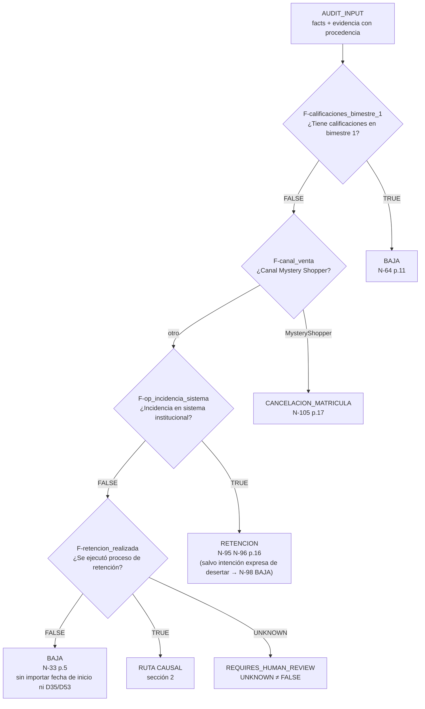
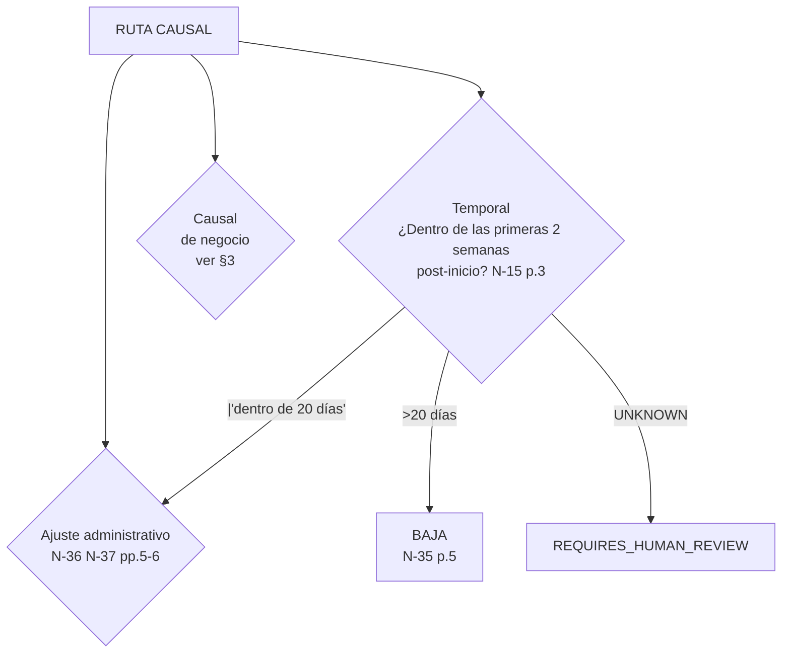

# Árbol de Decisión Normativo — GDM_GAM_PRD_MLG_003 v5

**Fase:** Decision Tree Phase 1 — Especificación legible por humanos
**Fuente:** `GDM_GAM_PRD_MLG_003` v5, `14/09/2026`, SHA-256 `71faf646…96c7d2`
**Estado:** `TREE_SPECIFIED` (especificación; **sin motor implementado**)
**Frontera activa:** `AUDIT_ENGINE_NOT_IMPLEMENTED`

> Este documento **no** implementa el motor. Describe qué decidirá el motor
> cuando exista, con qué citas, y dónde el documento **no** permite decidir.
> Las ramas que el documento no resuelve terminan en
> `REQUIRES_OWNER_DECISION`, no en un default.

---

## 0. Desenlaces derivados de la fuente

La fuente establece **cinco** desenlaces. No son un catálogo cerrado heredado:
salen de la lectura del inventario.

| Desenlace | Definición operativa | Enunciados que lo establecen |
|---|---|---|
| `CANCELACION_VENTA` | Cancelación de la venta | 18 enunciados (`N-27`, `N-30`, `N-39`…`N-111`) |
| `BAJA` | Baja definitiva del estudiante | 6 enunciados (`N-28`, `N-33`, `N-35`, `N-53`, `N-64`, `N-98`) |
| `CANCELACION_VENTA_OPERATIVA` | CV sin impacto de equipo | 8 enunciados (`N-48`, `N-82`, `N-92`…`N-102`) |
| `CANCELACION_MATRICULA` | Solo canal Mystery Shopper | 1 enunciado (`N-105`) |
| `RETENCION` | Gestión obligatoria, sin desenlace de salida aún | 6 enunciados (`N-31`, `N-32`, `N-38`, `N-42`, `N-76`, `N-79`) |
| `DICTAMINACION` | Escalamiento a área competente | 4 enunciados (`N-13`, `N-14`, `N-58`, `N-89`) |
| `REQUIRES_OWNER_DECISION` | **No decidido por la fuente** | Derivado, no deriva de texto |
| `REQUIRES_HUMAN_REVIEW` | Evidencia insuficiente | Derivado de `UNKNOWN_IS_NOT_FALSE` |

`REQUIRES_OWNER_DECISION` y `REQUIRES_HUMAN_REVIEW` no son desenlaces del
documento: son los dos estados en los que el motor **debe** detenerse cuando la
fuente no alcanza. Declararlos aquí impide que una implementación los sustituya
por un `CANCELACION_VENTA` o `BAJA` por defecto.

---

## 1. Raíz: filtro de prevalencia

El árbol no empieza por «qué causal», sino por tres filtros que, si se activan,
determinan el desenlace sin evaluar el resto. Son las reglas que el documento
presenta con lenguaje de prevalencia («por ningún motivo», «sin que… afecten»).

### 1.1 Filtro 1 — Devengo de servicio (`N-64`, p.11)

> «Si en el bimestre 1 o inicial ya tiene calificaciones, **por ningún motivo**
> podrá ser considerado como cancelación de venta y deberá ser considerado como
> una baja, debido al devengamiento del servicio. Esto incluye cualquier tipo de
> información, como tema de convalidación, etc.»

Es el enunciado más fuerte del documento en materia de prevalencia: «por
ningún motivo» cierra la puerta a **toda** causal de CV, incluidas las
operativas y la promesa de venta no cumplida. Se implementa como cortocircuito
antes de cualquier evaluación causal.

### 1.2 Filtro 2 — Canal Mystery Shopper (`N-105`, p.17)

> «Todas las ventas que ingresen a través del canal de Mystery Shopper aplican
> como: "cancelación de matrícula"… no impacta el indicador de cancelaciones de
> venta.»

### 1.3 Filtro 3 — Incidencia de sistema (`N-95`, p.16)

> «**No aplicará** la política operativa de cancelación cuando la falta de
> activación, acceso o continuidad del estudiante sea consecuencia de una
> incidencia identificada en el Aula Virtual, SIU u otros sistemas
> institucionales».

Desactiva la sección 5.9 completa. Con `N-98`, si el estudiante expresa
intención de desertar por la incidencia, el desenlace es **baja**.

### 1.4 Filtro 4 — Falta de retención (`N-33`, p.5)

> «En caso de no realizarse el proceso de retención… la solicitud deberá
> gestionarse como baja, **sin que la fecha de inicio ni la aplicación de D35 o
> D53 afecten dicha determinación**.»

`N-33` es la regla que más desenlaces cierra. Nótese el conflicto sin resolver:
si el caso reúne «solicitud previa al inicio» (`N-27` → CV) y «falta de
retención» (`N-33` → baja), el documento no declara prevalencia. Se registra en
`AMB-CON-01` y el árbol **no** lo resuelve: ambas ramas están activas y el
motor escala.

---

## 2. Ruta causal

Evaluada solo si los cuatro filtros de la §1 resultaron en `FALSE`.

### 2.1 Regla temporal rectora (`N-35`, p.5)

> «transcurridos 20 días desde la fecha de inicio del ciclo, cualquier solicitud
> deberá gestionarse como baja, debido a que el estudiante habrá devengado un
> mes de servicio.»

`N-35` («cualquier solicitud») es **más amplia** que `N-15` (que solo regula la
*solicitud* de CV en 2 semanas). Se modelan como ventanas distintas con
prevalencia declarada: `N-35` gobierna sobre `N-15` porque «cualquier solicitud»
incluye la solicitud de CV. Ver `AMB-TEM-02`.

**Consecuencia:** una solicitud a día 22 produce `BAJA` con independencia de la
causal. Esto es coherente con `N-64` (mismo fundamento: devengo de servicio) y
con `N-103` (cierre financiero en semana 3).

---

## 3. Árbol de causales

Cada rama declara: condición, hechos, desenlace, cita y —cuando aplica— la
polaridad o el riesgo de inversión.

### 3.1 `CAUSAL-V` — Error de inscripción / ajuste administrativo

| Campo | Valor |
|---|---|
| **Condición** | Ajuste administrativo solicitado por el estudiante y/o por error de inscripción, dentro de los 20 días post-inicio |
| **Hechos** | `F-ajuste_por_error_inscripcion`, `F-tipo_ajuste`, `F-habil_1_20_dias` |
| **Desenlace** | `CANCELACION_VENTA` o `BAJA` **solo si** el estudiante desea y expresa tácitamente no continuar |
| **Cita** | `N-36` p.5→6, `N-37` p.6 |
| **Riesgo** | El documento dice «aplica cancelación de venta **o** baja, solo si…». **No declara cuál.** |

Texto literal: «aplica cancelación de venta o baja, solo si el estudiante por
este motivo desea y expresa de manera tácita el no querer continuar».

> **Punto crítico:** «expresa de manera tácita» es una contradicción interna del
> original (tácito = no expreso). El documento no define cómo se verifica la
> expresión tácita. `REQUIRES_OWNER_DECISION` → `AMB-CON-04`.

Sub-casos enumerados en `N-37` (p.6): cambio de programa, ajuste de paquete,
cambio de ciclo de inicio, cambio de campus con transferencia de saldo.

### 3.2 `CAUSAL-EE` — Error de inscripción en área de aprobación

| Campo | Valor |
|---|---|
| **Condición** | El ajuste corresponde a GM o EE, dentro del plazo de 20 días |
| **Hechos** | `F-habil_1_20_dias`, `F-ajuste_por_error_inscripcion` |
| **Desenlace** | Ajuste aplicable; si no procede ningún trámite o está fuera de plazo → escalar a Mejora Continua + ofrecer segunda inscripción |
| **Cita** | `N-43`, `N-44` p.7 |
| **Nota** | `N-44` no produce desenlace de CV/baja; produce **gestión**. Se clasifica como `RETENCION`/`DICTAMINACION`, no como cancelación. |

### 3.3 `CAUSAL-CICLO-A` — Cambio de ciclo gestionado **antes** del inicio

| Campo | Valor |
|---|---|
| **Condición** | Cambio de ciclo gestionado antes del inicio de clases por GM o EE |
| **Hechos** | `F-cambio_ciclo_antes_del_inicio = TRUE`, `F-cambio_ciclo_gestionado_por` |
| **Desenlace** | `CANCELACION_VENTA` |
| **Cita** | `N-41` p.7 |

Variante (`N-41` segundo párrafo): si tras el cambio, en el siguiente inicio, el
estudiante **no se localiza o no ingresa** → también `CANCELACION_VENTA`.
Hechos: `F-cambio_ciclo_no_localizable`, `F-cambio_ciclo_nuevo_no_ingresa`.

### 3.4 `CAUSAL-CICLO-B` — Cambio de ciclo gestionado **desde** el inicio (excepción)

| Campo | Valor |
|---|---|
| **Condición** | Cambio de ciclo gestionado por EE **a partir** del inicio de clases, y el estudiante no ingresa en el nuevo ciclo |
| **Hechos** | `F-cambio_ciclo_antes_del_inicio = FALSE`, `F-cambio_ciclo_gestionado_por = EE`, `F-cambio_ciclo_nuevo_no_ingresa` |
| **Desenlace** | `RETENCION` — **NO** aplica como cancelación de venta |
| **Cita** | `N-42` p.7 |
| **Tipo** | `exception` respecto de `CAUSAL-CICLO-A` |

> Esta es la excepción más limpia del documento. La misma hipótesis física
> («no ingresó en el nuevo ciclo») cambia de desenlace según **quién** gestiona
> y **cuándo**. Un motor que ignore `F-cambio_ciclo_gestionado_por` erraría en
> ambos sentidos.

Variante (`N-39`, p.6): si el estudiante **no autoriza** el cambio de ciclo
(estudiantes con revalidación/equivalencia en bloques intermedios) →
`CANCELACION_VENTA`.

Variante (`N-78`, p.13): si en el nuevo ciclo **desiste nuevamente** de su
ingreso → `CANCELACION_VENTA` o `BAJA` «según corresponda» (indeterminado,
`AMB-CON-04`).

### 3.5 `CAUSAL-PROMESA` — Promesa de venta no cumplida

| Campo | Valor |
|---|---|
| **Condición** | `(A) AND (B) AND (C)` |
| **A** | Información errónea/falsa/tendenciosa/no alineada durante la inscripción (`N-45`, p.7) |
| **B** | Decisión explícita del estudiante **derivada** de promesas no cumplidas (`N-46`, p.8) |
| **C** | Rechazo de beneficios adicionales: retención o ajustes correctivos (`N-46`, p.8) |
| **Desenlace** | `CANCELACION_VENTA` |
| **Cita** | `N-45`, `N-46` pp.7→8 |

#### Contraevidencia y excepción de esta causal

| Regla | Efecto | Cita |
|---|---|---|
| `N-50` (p.8) | Si Gestión de Validación realizó la interacción, registrada en tipificaciones, con speech de términos y condiciones → **NO** es promesa no cumplida | `counterevidence` |
| `N-52` (p.9) | Si **no** hay evidencias en sistemas oficiales → **SÍ** es CV por promesa no cumplida | expansión |
| `N-53` (p.9) | Validación completa, sin incidencias, registrada, **pero** el estudiante expresa intención de darse de baja → **BAJA** | `exception` |
| `N-54` (p.9) | Previo al inicio, GM conoce la solicitud e induce a modalidad de evaluación → CV, **con evidencia obligatoria** | `condition` |
| `N-56` (pp.9→10) | LATAM: sin evidencia de convalidación + estudiante no desea continuar → CV | `condition` |
| `N-57`/`N-58` (p.10) | Excede plazos: escalar y evaluar CV vs baja (**dos rutas distintas**) | `AMB-CON-02` |

> **Conflicto duro:** `N-46` **restringe** la causal a tres requisitos; `N-52`
> la **expande** a «sin evidencias → CV». Un caso con información errónea
> acreditada pero sin rechazo de beneficios: `N-46` dice que no aplica;
> `N-52` dice que sí. El documento no resuelve. → `AMB-CON-03`,
> `REQUIRES_OWNER_DECISION`.

### 3.6 `CAUSAL-ILOC` — Estudiante ilocalizable

| Campo | Valor |
|---|---|
| **Condición** | `NOT(contacto_efectivo) AND dentro_ventana` |
| **Ventana** | Hasta el domingo de la semana 2 (`N-68`, p.12) |
| **Hechos** | `F-antes_domingo_semana_2`, hechos de contacto efectivo §6.1, hechos de actividad §6.2 |
| **Desenlace** | `CANCELACION_VENTA` |
| **Citas** | `N-68` p.12, `N-70`…`N-75` pp.12→13 |
| **Conectiva de 5.8.h** | **INDETERMINADA** → `AMB-LOG-04` |

#### 3.6.1 Tres contraevidencias que anulan la causal

| Regla | Condición | Efecto | Cita |
|---|---|---|---|
| `N-74` | Actividad en **al menos una** asignatura (ingreso o modalidad, según nivel) | **NO** aplica CV | p.13 |
| `N-75` | **Cualquier** contacto durante gestión de GM, Mejora Continua o Dictaminación | **NO** es ilocalizable | p.13 |
| `N-91` | EE no cumple nº/% de interacciones **y** sin causa operativa documentada | El requisito de gestión **no se acredita** | p.15 |

> `N-74` y `N-75` son las contraevidencias más amplias del documento. `N-75`
> basta con **cualquier** contacto, incluso no efectivo. Esto es coherente con
> la construcción negativa de `N-68` («cuando no se logre establecer **ningún**
> contacto efectivo»).

#### 3.6.2 La trampa de polaridad (§6.2 del catálogo de hechos)

| Nivel | Condición redactada | Hecho | Polaridad del hecho |
|---|---|---|---|
| Licenciatura | «Haber seleccionado la modalidad…» / «tres ingresos…» | `F-actividad_licenciatura` | `TRUE` = **hay** actividad = localizado |
| Posgrado/Ejecutiva | «**No** haber registrado participación en foros» | `F-actividad_posgrado` | `TRUE` = **no hay** actividad = ilocalizable |
| Alianza | «**No** haber ingresado a ninguna asignatura» | `F-actividad_alianza` | `TRUE` = **no hay** actividad = ilocalizable |
| Diplomado | «**No** haber registrado participación en foros» | `F-actividad_diplomado` | `TRUE` = **no hay** actividad = ilocalizable |

**Los cuatro enunciados usan la misma estructura gramatical; tres tienen
polaridad opuesta.** Implementar con una bandera única invierte el resultado en
posgrado, alianza y diplomado. La polaridad debe vivir en la **definición** del
hecho, no en el `if` del evaluador. → `AMB-LOG-02`.

### 3.7 `CAUSAL-ILOC-ESPECIAL` — Localizado sin ingreso al aula

| Campo | Valor |
|---|---|
| **Condición** | Hay contacto pero **no** ingreso al aula |
| **Si EE/GM cumplieron las 4 acciones de activación** | `RETENCION` |
| **Si NO** las cumplieron | `CANCELACION_VENTA` |
| **Hechos** | `F-acciones_activacion_gm`, `F-ingreso_aula_regular` |
| **Citas** | `N-79`, `N-80` p.14 |

Las 4 acciones (`N-79`, p.14): (1) transferir a EE o dar instrucciones de
ingreso; (2) confirmar y actualizar datos de contacto en sistema; (3)
proporcionar ligas de contacto de EE y oficinas virtuales; (4) notificar
formalmente a EE por correo con datos actualizados.

### 3.8 `CAUSAL-BOT` — Contacto único con bot

| Campo | Valor |
|---|---|
| **Condición** | Única interacción = BOT/Asistente Virtual, sin contacto con Gestor de EE |
| **Si ambos equipos (VV y EE) cumplieron sus gestiones** | `CANCELACION_VENTA_OPERATIVA` (baja/cancelación «Operativa») **sin impacto** en ninguno de los dos equipos |
| **Desenlace** | `CANCELACION_VENTA_OPERATIVA` |
| **Cita** | `N-82` p.14 |
| **Consecuencia** | No impacta indicadores de equipo; solo el indicador general |

### 3.9 `CAUSAL-OPERATIVA` — Cancelaciones operativas (5.9)

Desactivada si `F-op_incidencia_sistema = TRUE` (filtro 3, `N-95`).

| Sub-causal | Condición | Desenlace | Cita |
|---|---|---|---|
| `OP-A` | Error de Servicios Escolares otorga D35 a quien no cumple perfil/documentación. **Excluye canales College y Upselling** | `CANCELACION_VENTA_OPERATIVA` | `N-93` p.16 |
| `OP-B` | Error administrativo de Finanzas/Cobranza, ajeno a inscripción, que genera afectación en la experiencia y motiva no continuar | `CANCELACION_VENTA_OPERATIVA` | `N-94` p.16 |
| `OP-C` | Falta de activación por incidencia en Aula Virtual/SIU | **Desactiva operativa** | `N-95` p.16 |
| `OP-D` | Área operativa no canalizó ni notificó a EE | `CANCELACION_VENTA_OPERATIVA` | `N-99` p.16 |
| `OP-E` | Error en seguimiento de EE o en solicitud de gestión vía Flokzu | `CANCELACION_VENTA_OPERATIVA` | `N-100` p.17 |
| `OP-F` | Discrepancia 100 % del paquete de venta, y el error es del **proceso** no del asesor | `CANCELACION_VENTA` | `N-101` p.17 |
| `OP-G` | Error en validación de venta por Back Office que genera la solicitud | `CANCELACION_VENTA_OPERATIVA` | `N-102` p.17 |
| `OP-H` | Actualización de producto sin capacitación/comunicación formal a Operaciones por RRHH | `CANCELACION_VENTA_OPERATIVA` | `N-48` p.8 |

> **Inconsistencia de clasificación registrada:** `OP-A` a `OP-E` y `OP-G`
> concluyen «cancelación de venta operativa» (`N-92`), pero `OP-F` (`N-101`)
> concluye textualmente «aplicará cancelación de venta», **sin** el calificativo
> operativa. El documento no explica la diferencia. → `AMB-LOG-05`.

**Cierre por tiempos (`N-103`, `N-104`, p.17):** el equipo financiero tiene plazo
hasta la **semana 3** para cancelar saldo y fijar el estatus. Concluido el
plazo, el estatus es **inmutable**: no se revierte CV↔baja en ningún sentido.
Esto es una frontera de irreversibilidad, no una condición de entrada.

### 3.10 `CAUSAL-QUORUM` — Falta de quórum (5.11)

| Campo | Valor |
|---|---|
| **Condición** | Programa no alcanza el mínimo de estudiantes para apertura **Y** el estudiante no acepta reprogramación |
| **Hechos** | `F-quorum_no_alcanzado`, `F-evidencia_alternativa_reprogramacion`, `F-estudiante_rechaza_alternativa`, `F-grupo_no_abierto` |
| **Desenlace** | `CANCELACION_VENTA` |
| **Citas** | `N-106`…`N-111` pp.17→18 |
| **Exención temporal** | `N-108`, `N-112` p.18 |

#### Exención temporal expresa

> «La solicitud podrá realizarse antes o después de la fecha de inicio» (`N-108`,
> p.18)
> «La fecha de solicitud **no limitará** la aplicación de este criterio» (`N-112`,
> p.18)

Esta causal **prevalece sobre `N-15`** (ventana de 2 semanas), por texto
expreso. Es la única prevalencia temporal declarada en el documento. → La
implementa `CAUSAL-QUORUM` con `overrideTemporal = 'N-112'`.

### 3.11 `CAUSAL-ILOC-SOLIC` — Estudiante ilocalizable que se presenta

| Campo | Valor |
|---|---|
| **Condición** | El estudiante ilocalizable contacta al Asesor de Ventas y pide no continuar |
| **Obligación** | El Asesor **debe** canalizar de inmediato a EE |
| **Desenlace** | El proceso lo realiza EE «dependiendo de los tiempos estipulados para la decisión 35 (proceso de retención o cancelación de venta)» |
| **Cita** | `N-81` p.14 |
| **Determinación** | **Delegada**: el desenlace no lo fija `N-81`; lo fijará la aplicación de la regla D35 según tiempos. |

### 3.12 `CAUSAL-D53` — Requisitos de la Decisión 53

| Campo | Valor |
|---|---|
| **Condición** | Matriculación dependiente de requisitos evaluados mediante D53 |
| **Obligación** | Cumplir lo estipulado en «Anexo 5. Políticas y Normas Aplicables a la Decisión 53» |
| **Citas** | `N-67` p.12, `N-63` p.11, `N-31` p.5 |
| **Estado** | `REQUIRES_OWNER_DECISION` — el Anexo 5 **no está en la fuente de Fase 1** |

### 3.13 `CAUSAL-ILOC-DOC` — Falta de documentos de ingreso

| Sub-causal | Condición | Desenlace | Cita |
|---|---|---|---|
| `DOC-A` | Sin documento que acredite grado previo → entrega carta manifiesto; si dice que **no podrá entregar en plazo** | `CANCELACION_VENTA` | `N-59`, `N-60` pp.10→11 |
| `DOC-B` | BO valida que el estudiante **no acredita** el grado previo requerido (incluye D53 con convenio firmado) | `CANCELACION_VENTA` por invasión de ciclo | `N-63` p.11 |
| `DOC-C` | Historial que no avala el 100 % de créditos, o no cuenta con constancia de término/examen único | No se fija desenlace en el inciso | `N-66` p.12 |

> `DOC-C` (`N-66`, p.12) enuncia un requisito («deberá contar por lo menos con…»)
> sin declarar qué ocurre si no se cumple. El documento **no** fija desenlace.
> → `AMB-GAP-02`, `REQUIRES_OWNER_DECISION`.

### 3.14 `ESCALAMIENTO` — Dictaminación

| Campo | Valor |
|---|---|
| **Condición 1** | Mejora Continua no logra emitir definición | `N-13` pp.2→3 |
| **Condición 2** | La cancelación deriva de una nueva iniciativa | `N-14` p.3 |
| **Condición 3** | Respuesta del estudiante vinculada a otra política/lineamiento | `N-89` p.15 |
| **Condición 4** | Desbordamiento de plazos con evidencia de promesa no cumplida | `N-57` **o** `N-58` → `AMB-CON-02` |
| **Desenlace** | `DICTAMINACION` |
| **Responsable** | Auditoría de Cancelaciones de Venta (`N-13`) / Dictaminación (`N-123`) |

---

## 4. Lógica de tres valores

### 4.1 Conjuntos

| Conectiva | `UNKNOWN` se propaga | `UNKNOWN` se resuelve | Justificación |
|---|---|---|---|
| `AND` | `FALSE` dominate | `UNKNOWN ∧ TRUE = UNKNOWN` | Un dato faltante puede ocultar el incumplimiento |
| `OR` | `TRUE` dominate | `UNKNOWN ∨ FALSE = UNKNOWN` | Un dato faltante puede ocultar el cumplimiento |

**Verificación de las cuatro leyes:**

| Expresión | Resultado | Razón |
|---|---|---|
| `UNKNOWN ∧ TRUE` | `UNKNOWN` | el `TRUE` no cierra el dato faltante |
| `UNKNOWN ∧ FALSE` | `FALSE` | el `FALSE` cierra: la conjunción es falsa sea cual sea el otro operando |
| `UNKNOWN ∨ TRUE` | `TRUE` | el `TRUE` cierra: la disyunción es verdadera sea cual sea el otro operando |
| `UNKNOWN ∨ FALSE` | `UNKNOWN` | el `FALSE` no cierra el dato faltante |

### 4.2 `UNKNOWN` en el árbol de decisión

| Posición del `UNKNOWN` | Resultado | Razón |
|---|---|---|
| En un filtro de prevalencia | **No se puede continuar** | un filtro de prevalencia ignorado puede invertir el desenlace |
| En una causal, y existen otras causales evaluables | Se evalúan las demás | el `UNKNOWN` no se propaga a la decisión si otra rama cierra |
| En **todas** las causales | `REQUIRES_HUMAN_REVIEW` | `UNKNOWN` no es `FALSE` |
| En `F-marcaciones_colapsadas` | `REQUIRES_OWNER_DECISION` | el umbral no existe en la fuente (`AMB-NUM-02`) |
| En la conectiva de 5.8.h | `REQUIRES_OWNER_DECISION` | la fuente no declara `AND`/`OR` (`AMB-LOG-04`) |
| En un umbral temporal en conflicto | `REQUIRES_OWNER_DECISION` | hay 7 umbrales y ninguno prevalece (`AMB-TEM-01`…`05`) |

### 4.3 Cenelas (sentinelas) y su conversión

| Centinela | No se convierte a `FALSE` | Razón |
|---|---|---|
| `NOT_APPLICABLE` | La condición se **excluye** del caso | la norma excluye el caso, no falta información |
| `NOT_OBSERVED` | Se reporta como `UNKNOWN` con `unknownReason` | se buscó y no existe |
| `PENDING` | Se reporta como `UNKNOWN` con `unknownReason` | gestión en curso, aún no cumple ni incumple |
| `NOT_EXTRACTABLE` | Se reporta como `UNKNOWN` con `unknownReason` | evidencia inaccesible (`N-51`) |

> **Prohibición explícita:** ningún centinela puede convertirse en `FALSE` para
> «desbloquear» una decisión. Un centinela no es evidencia de incumplimiento.

---

## 5. Ventanas temporales consolidadas

Siete umbrales distintos, sin prevalencia declarada salvo `AMB-TEM-03`.

| # | Umbral | BASE | Enunciado | Efecto | Prevalencia declarada |
|---|---|---|---|---|---|
| 1 | 1 día antes del inicio | inicio | `N-35` p.5 | Límite para cambios/ajustes | ninguna |
| 2 | 2 semanas post-inicio | inicio | `N-15` p.3 | Límite para solicitar CV | derogada por `N-112` (quórum) |
| 3 | Primer domingo del ciclo | inicio | `N-29` p.4 | Límite de solicitud con D35/D53 tardía | ninguna |
| 4 | 20 días post-inicio | inicio | `N-35` p.5 | Cualquier solicitud → baja | **gobierna sobre #2 y #3** (término «cualquier solicitud») |
| 5 | Domingo de semana 2 | inicio | `N-68` p.12 | Límite de ilocalizable | ninguna |
| 6 | Semana 3 post-inicio | inicio | `N-103` p.17 | Cierre financiero; estatus inmutable | ninguna |
| 7 | 30 días hábiles / 30 días | inicio | `N-07` p.2 / `N-114` p.18 | Definición de deserción | **conflicto entre ambas** → `AMB-DEF-01` |

**Precisión sobre el solapamiento de Sundays:** el «primer domingo del inicio
del ciclo» (nº 3) y el «domingo de la semana dos» (nº 5) **no son el mismo día**
—el primero cierra la semana 1 y el segundo la semana 2— por lo que no se
contradicen entre sí. Lo que el documento **no** declara es cuál de los dos
límites prevalece cuando un caso cae entre ambos domingos, ni si el umbral de 20
días (nº 4, que fuerza `BAJA`) trunca ambos. Sin esa declaración, un caso entre
el primer y el segundo domingo tiene **dos ventanas temporales incompatibles y
sin regla de orden** → `AMB-TEM-06`.

Además, `N-29` (nº 3) es **más estricto** que `N-15` (nº 2) para el supuesto
D35/D53 tardío, sin declarar que sea una excepción. Y `N-35` (nº 4) fuerza
`BAJA` a los 20 días, lo que dejaría sin efecto práctica a los límites de 2 y 3
semanas. Ninguna de estas relaciones está declarada en la fuente.

---

## 6. Sustituciones prohibidas

 Ninguna de estas constructions puede aparecer en una implementación futura, y
todas están ausentes de este árbol:

| Construcción prohibida | Motivo | Dónde NO aparece |
|---|---|---|
| Enum de 3 desenlaces fijo | La fuente tiene ≥5 desenlaces | §0 lista 7 estados |
| `NON_LICENCIATURA` | No existe en la fuente | Ausente |
| `ShadowPolicyResult` / `DECLARATIVE_SHADOW` | Retirado | Ausente |
| `policy_code`/`policy_version` como identificador de regla | Retirado | Las reglas se identifican por sección `N-xx` |
| Motor con exactamente 3 reglas | La fuente tiene 139 enunciados | §12 del inventario |
| `UNKNOWN` colapsado a `FALSE` | `UNKNOWN_IS_NOT_FALSE` | §4.3 lo prohíbe explícitamente |
| Prevalencia operacional presentada como política | `OPERATIONAL_PRECEDENCE_IS_NOT_POLICY` | §7 |

---

## 7. Precedencia operacional (separada de la política)

Conforme a `OPERATIONAL_PRECEDENCE_IS_NOT_POLICY`, cualquier prioridad aprobada
por el Owner se almacena y se muestra **separada** de la fuente normativa, con
procedencia propia. En Fase 1 **no existe** ninguna precedencia operacional:
no hay ninguna lectura del Owner registrada.

| Regla de precedencia | ¿Existe? | Procedencia |
|---|---|---|
| Precedencia de `N-46` sobre `N-52` | **NO** — requiere decisión | `AMB-CON-03` |
| Precedencia de `N-33` sobre `N-27` | **NO** — requiere decisión | `AMB-CON-01` |
| Precedencia de `N-57` sobre `N-58` | **NO** — requiere decisión | `AMB-CON-02` |
| Precedencia de `N-35` sobre `N-15`/`N-29` | **Parcial** — el texto la sugiere («cualquier solicitud») pero no la declara | `AMB-TEM-02` |
| Precedencia de `N-112` sobre `N-15` | **Parcial** — «no limitará la aplicación» es explícito para quórum | `AMB-TEM-03` |
| Conectiva de `5.8.h` | **NO** — el documento no la declara | `AMB-LOG-04` |
| Umbral de colapso de llamadas | **NO** — el valor no existe | `AMB-NUM-02` |

**Regla dura:** en Fase 2, ninguna de estas filas puede completarse con una
solución técnica. Cada una requiere una decisión del Owner registrada con
documento, versión, sección y fecha. Un default de código es una
`REQUIRES_OWNER_DECISION` encubierta.

---

## 8. Resumen de nodos

| Tipo de nodo | Cantidad |
|---|---|
| Filtros de prevalencia (sección 1) | 4 |
| Regla temporal rectora | 1 |
| Causales de negocio | 14 (`CAUSAL-V`, `CAUSAL-EE`, `CAUSAL-CICLO-A/B`, `CAUSAL-PROMESA`, `CAUSAL-ILOC`, `CAUSAL-ILOC-ESPECIAL`, `CAUSAL-BOT`, `CAUSAL-OPERATIVA` + 7 sub-causales OP, `CAUSAL-QUORUM`, `CAUSAL-ILOC-SOLIC`, `CAUSAL-D53`, `CAUSAL-ILOC-DOC` + 3 sub-causales DOC) |
| Ramas de escalamiento | 4 |
| Desenlaces posibles | 6 + 2 de detención |
| Umbrales temporales en conflicto | 7 |
| Decisiones de Owner pendientes | 7 (sección 7) |
| Ambigüedades registradas | 28 (ver `ambiguities.md`) |

---

## 9. Frontera

Este documento no contiene código ejecutable, no invoca InsForge, ni OpenRouter,
ni AssemblyAI, ni el sistema de archivos, ni HTTP. Es texto normativo
legible. El motor permanece en `AUDIT_ENGINE_NOT_IMPLEMENTED`.
