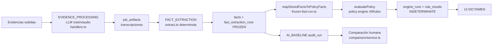

# Análisis de Arquitectura: Auditoría Híbrida IA + Rule Engine

> **Documento pre-implementación** — describe el estado actual del sistema de auditorías de cancelación, los problemas encontrados, y el diseño objetivo de la arquitectura híbrida (Evidence Interpreter → Facts/Graph → Policy Reasoner (IA) → Rule Engine validador → Adjudicator → resultado probable → comparación humana a ciegas).
> **Fecha:** 2026-09-24
> **Proyecto:** Cancelaciones (InsForge, API base `https://4pw4jdzv.us-west.insforge.app`)
> **Política inmutable:** `GDM_GAM_PRD_MLG_003` (versión canónica 5, con heredera v2)

---

## 1. Estado actual

El sistema es una aplicación Next.js (monorepo `cancelaciones-ai`) que orquesta auditorías de cancelación de venta a partir de evidencias subidas (PDF, imágenes, audio, texto, CSV, docx, xlsx). El backend de datos es InsForge (Postgres). El pipeline actual:

1. **Subida de evidencias** → bucket `dictamen-evidencias`, tabla `evidences`.
2. **METADATA_PROBE / EVIDENCE_PROCESSING** → análisis multimodal por LLM (visión/audio vía OpenRouter), se guardan `job_artifacts` con transcripciones textuales.
3. **FACT_EXTRACTION** → `extractFactsFromArtifacts` (determinista) produce `facts` (11 tipos observables) y registra `fact_extraction_runs` (estado `FROZEN`).
4. **Evaluación de política** → `POST /api/audits/[auditId]/policy` crea `engine_runs` + `engine_rule_results` vía `evaluatePolicy` (rule engine puro/determinista), y `AI_BASELINE` en `audit_runs`.
5. **Comparación** (fase 8/9 ya existente) → `human_decision_extracts` (dictamen humano extraído por IA), `audit_comparisons`, `final_adjudications`, réplicas con `human_reviews`.

El resultado del motor se muestra en la pestaña **DICTAMEN** (`AuditWorkspace.tsx`) y las reglas en **REGLAS**.

### Datos reales (audit `48680b8f-f2c6-41c2-ae73-19c22b5e19c6`)

- `fact_extraction_runs`: 1 (FROZEN, extractor `deterministic-facts-v1`).
- `facts`: 11 registros.
- `engine_runs`: 1, estado `COMPLETED`, `outcome_status = 'INDETERMINATE'`.
- `engine_rule_results`: 3 (2 `UNKNOWN`, 1 `NOT_SATISFIED`).
- Evidencias: 5 objetos en storage; 40 tablas en la base.

**Ese es exactamente el problema que este trabajo resuelve:** el motor devolvió `INDETERMINATE` en un caso donde un humano ve claro "estudiante ilocalizable".

---

## 2. Flujo actual (as-is)

---

## 3. Arquitectura encontrada (inventario)

### Paquetes
| Paquete | Rol |
|---|---|
| `@cancelaciones/domain` | Tipos raíz: `AuditRun`, `AuditRunType`, `JobType`, `DocumentRole`, `stableFingerprint`, validación de archivos. |
| `@cancelaciones/db` | Repositorios sobre InsForge (facts, fact_extraction_runs, engine_runs, audit_runs, human_reviews, comparison, evidences, jobs). |
| `@cancelaciones/policy-engine` | `evaluatePolicy`, reglas v2/v5 de `GDM_GAM_PRD_MLG_003`, comparación histórica (`comparison.ts`), utilidades de fechas y contactos. Puro y determinista. |
| `@cancelaciones/reporting` | Reportes fase 0–8 (docs). |

### Tablas clave (migraciones existentes)
| Tabla | Origen | Uso |
|---|---|---|
| `evidences` | fase 1–4 | evidencias con `document_role` (`EVIDENCE`/`HUMAN_DECISION_DOCUMENT`/`ADJUDICATION_EVIDENCE`) y `sha256`. |
| `job_artifacts` | fase 4/5 | artefactos por job (transcripción visual/audio, `extractedFacts`, `contentSha256`). |
| `facts` | fase 5 | hechos por artefacto: `fact_type`, `classification` (`OBSERVABLE`…), `value jsonb`, `source_ref` (provenance con evidenceId/artifactId/sha256), `confidence`. |
| `fact_extraction_runs` | fase 5 | corrida congelada: `policy_code`, `policy_version`, `extractor_version`, `artifact_set_fingerprint`, `state=FROZEN`. |
| `engine_runs` | fase 6 | `fact_run_id`, `policy_code/version`, `rules_fingerprint`, `facts_fingerprint`, `status`, `suggested_outcome`, `outcome_status`, `evaluation jsonb` (evaluación completa). |
| `engine_rule_results` | fase 6 | por regla: `rule_id`, `status`, `result jsonb` (condiciones, factsUsados, missingFacts). |
| `audit_runs` | fase 9 | `run_type CHECK ('AI_BASELINE','HUMAN_DECISION','AI_COMPARISON','AI_RECONCILIATION','FINAL_ADJUDICATION')`, `policy_code/version`, `prompt_version`, `model`, `input_fingerprint`, `result jsonb`. |
| `human_decision_extracts` | fase 9 | dictamen humano extraído (``resultado``, fundamentos), aislado por `document_role='HUMAN_DECISION_DOCUMENT'`. |
| `audit_comparisons` | fase 9 | comparación IA vs humano (MATCH/DISCREPANCY + discrepancyType). |
| `final_adjudications` | fase 9 | adjudicación final (CONFIRM_AI/CONFIRM_HUMAN/BOTH_INCORRECT/…). |
| `human_reviews` | fase 7 | aprobación/corrección (`decision_type` APPROVE/CORRECT), UNIQUE por audit. |

### Capacidad LLM existente (reutilizable)
- `apps/web/src/server/ai/openrouter.ts` → `requestStructuredCompletion` (temperature 0, `response_format json_object`, sin cadena de pensamiento) + `parseJsonFromCompletion`.
- `apps/web/src/server/config/env.ts` → `OPENROUTER_MODEL` default `google/gemini-2.5-flash`, validado con Zod.
- `apps/web/src/server/jobs/handlers.ts` → prompts de visión/audio para evidencia (EVIDENCE_PROCESSING) y extracción humana (HUMAN_DECISION_EXTRACTION, AI_RECONCILIATION).

### Catálogos normativos (docs/policy)
- `rule-inventory.md`, `fact-inventory.md`, `v5-coverage.md`, `traceability-matrix.md` → fuente canónica de reglas de `GDM_GAM_PRD_MLG_003` permitidas para el Reasoner IA (nunca inventar normas).

---

## 4. Rule Engine actual (`evaluatePolicy`)

- **Función pura** `evaluatePolicy({ policyCode, policyVersion, facts, ownerPrecedences })` → `PolicyEvaluation`.
- Agrupa reglas por categoría: `OUTCOME_RULE` (5.8.a), `EXCLUSION_RULE` (5.7.e), `PROCESS_RULE` (5.2 contactos), `EVIDENCE_RULE`, `SLA_RULE`, `INFORMATIONAL_RULE`.
- Estados por regla: `SATISFIED / NOT_SATISFIED / UNKNOWN / NOT_APPLICABLE / BLOCKED_BY_MISSING_NORMATIVE_SOURCE`.
- **Lógica de agregación actual:**
  - `unique.length > 1` → `CONFLICTED`.
  - `suggestedOutcome` = outcome de reglas SATISFIED.
  - Cualquier `UNKNOWN`/`BLOCKING`/conflicto → `requiresReview`.
  - **Sin outcome y con unknowns → `INDETERMINATE`** (el punto de falla de la auditoría 48680).
- Estados resultados: `OutcomeStatus = DETERMINED | DETERMINED_WITH_WARNINGS | CONFLICTED | INDETERMINATE`; `DecisionStatus = READY_TO_APPROVE | REVIEW_REQUIRED | CONFLICTED | INDETERMINATE`.
- Ya produce: `missingData`, `missingEvidence`, `softwareCoverageGaps`, `nextActions`, `trace` (decisión → reglas → hechos → evidencias), fingerprints (rules/facts).
- **Deficiencia estructural:** asume hechos "aplastados" (uno por tipo). Con contradicciones, incompletud o formatos erróneos de valor (p.ej. `effectiveContact` como objeto de contactos en vez de booleano) no puede razonar: marca `UNKNOWN` y, si no hay outcome, **devuelve INDETERMINATE aunque la evidencia baste para un resultado probable**.

---

## 5. Responsabilidades

### Hoy (mezcladas)
1. Interpretar evidencia → hechos (determinista, sin IA en fact extraction de hechos: regex + `extractedFacts` de artefactos).
2. Mapear hechos de campo → hechos de política (pierde contradicciones).
3. Evaluar reglas (motores de condiciones 5.2, 5.7.e, 5.8.a).
4. Decidir outcome (solo si hay regla de outcome SATISFIED; si no, INDETERMINATE).
5. Guiar al humano (nextActions).
6. Comparar con dictamen humano.

### Objetivo (separación por capas)
| Capa | Responsabilidad | ¿Determinista? |
|---|---|---|
| **Evidence Interpreter** | Interpreta artefactos/evidencias → hechos con provenance y hash; detecta contradicciones entre artefactos; NO decide nada. | IA asistida + normalización determinista |
| **Facts/Graph** | Conjunto canónico de hechos + vínculos a evidencia + detección de contradicción/incompletud por hechos con misma fact_type y valores distintos (+ timeline). | Sí |
| **Policy Reasoner (IA)** | Razona sobre el grafo de hechos → **decisión candidata** (resultado probable) citando sección/numeral/regla/evidencia; interpreta evidencia, **nunca inventa normativa**. | IA, temperature 0, Zod, prompts versionados |
| **Rule Engine (validador)** | Valida la decisión candidata contra las reglas formales (5.2/5.7.e/5.8.a); marca `POLICY_VALIDATION_FAILED` si el candidato contradice reglas; reporta por-condición. | Sí (refactor de `evaluatePolicy`) |
| **Adjudicator** | Concilia candidato IA + validación de reglas → **resultado probable** con confianza explicable, gaps, pendientes, revisión humana obligatoria; NUNCA se oculta tras INDETERMINATE. | Determinista |
| **Comparación ciega** | Ejecuta auditoría máquina en modo `BLIND_MACHINE_AUDIT` (sin ver `humanDecision/humanResolution/humanReason/comparison`) y luego compara en `HUMAN_COMPARISON`. | n/a (modo) |

---

## 6. Problemas detectados

1. **`INDETERMINATE` como resultado final.** sin outcome y con unknowns el motor se rinde; el humano no recibe un RESULTADO PROBABLE con confianza y gaps.
2. **Pérdida de contradicciones:** `mapStoredFactsToPolicyFacts` toma el **primer** hecho por tipo (`entries[0]`), descartando duplicados con valores opuestos (ej. `classroom.hasActivities` true y false en la 48680).
3. **Formato de valor mal interpretado:** `contact.effectiveContact` llegó como objeto de contactos (email/phones), no como booleano; la regla `effective.value === false` falló y `no-effective-contact` se marcó FALSE (ver sección 7).
4. **Completitud inexistente en el flujo de hechos:** `extract.ts` marca `POTENTIALLY_PARTIAL_LIST` y `sourceCompleteness: PARTIAL` ante paginación/scroll; el motor convierte conteos con `completeness !== 'COMPLETE'` en `UNKNOWN` por diseño → las 45 llamadas/32 escritos reales se descartan como "fuente partial".
5. **Hechos faltantes → bloqueo silencioso:** `classroom.hasGrades` ausente → 5.7.e UNKNOWN → contribuye a INDETERMINATE aunque la exclusión no aplique por nivel/contexto.
6. **Sin capa de interpretación:** el sistema no produce un "relato del caso" (línea de tiempo: ticket, comentarios, intentos de contacto, réplicas, reaperturas, asignación, dictamen) reutilizable por humanos y comparación.
7. **Falta de AI_DECISION_V1 inmutable y de versionado de reevaluaciones** (AI_DECISION_V2 con `parentDecisionId`/`feedbackSources`/`reasonForReevaluation`): hoy una sola `AI_BASELINE` por `engine_run` (índice único parcial), sin cadena de versiones.
8. **Prompt/modelo sin versionar de extremo a extremo:** `prompt_version`/`model` existen en `audit_runs`, pero los prompts viven inline en `handlers.ts` y no hay directorio `prompts/` versionado; nada impide regenerar con un prompt distinto.
9. **Sin confianza explicable:** no existe modelo de confianza documentado; la confianza de hechos se propaga por `extractionConfidence` pero el motor no la usa.
10. **Leak de decisión humana al circuito máquina:** los modos `BLIND_MACHINE_AUDIT` / `HUMAN_COMPARISON` no existen todavía; nada garantiza hoy que el baseline no lea `humanDecision`/`humanResolution`/`humanReason`/`comparison`.
11. **UI dictamen oculta la verdad:** si `suggestedOutcome` es null, la pestaña DICTAMEN no muestra un resultado probable, confianza, checklist de validez 4/4, ni acciones concretas.

---

## 7. Razones probables de `INDETERMINATE` (auditoría 48680 — prueba real)

Migración `20260924170500_finish-audit-48680.sql` (hechos congelados + engine run). Desglose:

| Hecho (copia) | Valor | Evidencia | Efecto real |
|---|---|---|---|
| `classroom.hasActivities` | `true` | `6cc376b7` | motor lee **true** (primer hecho) |
| `classroom.hasActivities` | `false` | `b42eaa86` | **descartado** (duplicado) → condición "sin actividad" FALSE |
| `contact.effectiveContact` | objeto {email, phoneNumbers} | `51058508` | `effective.value===false` **FALSE** → `no-effective-contact` FALSE |
| `contact.callAttempts` | 45 llamadas, `sourceCompleteness: PARTIAL` | varias | `completeness !== 'COMPLETE'` → **UNKNOWN** (5.2 condiciones) |
| `contact.writtenInteractions` | 32 escritos, `PARTIAL` | varias | **UNKNOWN** (5.2) |
| `classroom.hasGrades` | ausente | — | 5.7.e **UNKNOWN** (`missingFacts`) |

**Resultado:** `GDM-V5-5.8-A-NON-LICENCIATURA` → `NOT_SATISFIED` + 2 reglas `UNKNOWN` → `INDETERMINATE`, `reviewRequired: true`. Un humano con la misma evidencia concluye "Cancelación de Venta por Estudiante Ilocalizable": sin ingreso a AV, sin actividad, 45 llamadas, 32 escritos, sin contacto efectivo. La experiencia es exactamente la queja del usuario: **el motor recibe hechos simplificados/incompletos y se rinde en vez de emitir un resultado probable validado.**

Regla a mantener: `UNKNOWN_IS_NOT_FALSE` y **UNKNOWN ≠ INDETERMINATE final** — debe existir un RESULTADO PROBABLE con pendientes.

---

## 8. Qué reutilizar

- `requestStructuredCompletion` (temperature 0, json_object) + `parseJsonFromCompletion` para el Policy Reasoner IA.
- `stableFingerprint` + fingerprints de facts/rules ya calculados en `PolicyEvaluation` y `fact_extraction_runs.artifact_set_fingerprint` (cache por hashes de artefactos, no por decisión).
- Tablas `facts`, `fact_extraction_runs`, `engine_runs`, `engine_rule_results`, `audit_runs`, `human_decision_extracts`, `audit_comparisons`, `final_adjudications`, `human_reviews`.
- `compareHistoricalOutcome` (`packages/policy-engine/src/comparison.ts`) y `apps/web/src/server/comparison/service.ts` para el modo `HUMAN_COMPARISON`.
- `AuditWorkspace.tsx`/`types.ts` (pestañas DICTAMEN/REGLAS/COMPARACIÓN) como base de UI; `synthetic-case` route como plantilla para el golden test CaVe-30591.
- Reglas v5 (`v5Rules`) como base del **validador**, con su trazabilidad (sección/página) y `softwareCoverageGaps` ya listados.
- Config Zod de env (modelo validado, default `google/gemini-2.5-flash`).
- `human_reviews` (APPROVE/CORRECT) para la confirmación/corrección humana del adjudicator.

---

## 9. Qué refactorizar

1. **`evaluatePolicy` → validador.** Nueva firma de alto nivel `validateCandidateDecision({ candidate, facts, policyCode, policyVersion })` que (a) consume hechos con contradicciones explícitas (conjunto completo, no `entries[0]`), (b) verifica que el outcome candidato sea compatible con las reglas formales, (c) emite `POLICY_VALIDATION_FAILED` si el candidato contradice una regla conocida, (d) conserva `PolicyEvaluation` y sus fingerprints para back-compat.
2. **`mapStoredFactsToPolicyFacts` → graph builder.** Generar un `EvidenceGraph` que conserve todas las observaciones por `fact_type` (agrupadas), marcando: `consistent`, `conflicting` (valores distintos con confianza suficiente), `observedCount`, `sourceCompleteness`, y resolución de contradicción por confianza/fecha/hash — en vez de quedarse con la primera.
3. **`extractFactsFromArtifacts`:** normalizar `contact.effectiveContact` para admitir bool o derivarlo de contacto efectivo detectado; conservar `sourceCompleteness` y `warnings` como datos de trazabilidad (el motor validador los usa para confianza, no para descartar el conteo: **45 llamadas PARTIAL siguen siendo 45 llamadas observadas**).
4. **Salida de la API `policy/route.ts`:** nuevo pipeline reasoner + validador + adjudicator que registra `AI_DECISION_V1`, y persiste evaluación + decisión candidata + validación.
5. **`audit_runs.run_type` CHECK:** extender para `BLIND_MACHINE_AUDIT`, `HUMAN_COMPARISON`, `AI_DECISION_V1`/`AI_DECISION_V2` (o equivalente) sin romper filas existentes.
6. **UI DICTAMEN:** mostrar "RESULTADO PROBABLE" + confianza + validación 4/4 (reglas, evidencia, contradicciones, normativa) + checklist de evidencia + warnings + evidencia faltante + botones aprobar/corregir. REGLAS: estado por regla con evidencias y explicación. COMPARACIÓN: solo cuando existe decisión humana.
7. **Línea de tiempo:** construir desde `facts.occurredAt` (intentos de contacto), comentarios, réplicas/reaperturas, asignaciones y dictamen; regla: comentarios tempranos ("se rechaza") nunca son resolución final, solo el dictamen/estado final.

---

## 10. Qué eliminar (o degradar)

- **`INDETERMINATE` como terminal del flujo.** Se reemplaza por RESULTADO PROBABLE + pendientes. El fallback distingue `MODEL_ERROR` / `PARSING_ERROR` / `INSUFFICIENT_EVIDENCE` / `POLICY_UNKNOWN` / `POLICY_CONFLICT` del INDETERMINATE real; toda corrida es reintentable.
- **Toma del "primer hecho por tipo"** (pérdida de contradicciones) en el camino hacia el adjudicator.
- **Prompts inline en `handlers.ts`** para el reasoner: se moverán a `prompts/<pipeline>/v<N>` versionados (job handlers existentes pueden conservarse si no se tocan, pero los prompts nuevos viven versionados).
- **Hardcodeos tipo `if (auditId === 'CaVe-30591')`:** prohibido.
- **(No romper)** `policySets` v2/v5 y los invariantes del repo AGENTS.md: `POLICY_IS_IMMUTABLE`, `UNKNOWN_IS_NOT_FALSE`, `PRESERVE_MACHINE_DECISION`, `DO_NOT_REPROCESS_AI_UNNECESSARILY`, motor puro/determinista.

---

## 11. Riesgos

| Riesgo | Mitigación |
|---|---|
| Regresión del rule engine determinista | Validador conserva `evaluatePolicy`/`PolicyEvaluation` intactos como base; se agrega, no se reemplaza el core. |
| Leak de decisión humana al circuito máquina | Modo `BLIND_MACHINE_AUDIT` con acceso aislado: el runner de auditoría no consulta `human_decision_extracts`/`audit_comparisons`/`human_reviews`; tests que fallan si se filtra. |
| IA "inventa" normativa o excepciones | Prompts con catálogo cerrado `rule-inventory`/`traceability-matrix`; Zod estricto; validador rechaza (`POLICY_VALIDATION_FAILED`) outcomes sin regla formal de respaldo. |
| Confianza arbitraria | Modelo de confianza explicable documentado (combinación de: consistencia del grafo, completitud de fuente, confianza de hechos, reglas validadas, sin contradicciones) — nunca decide la norma. |
| Reejecución no determinista | temperature 0 + structured output + versionado de prompt/modelo/política + fingerprints; cache de extracción por hash de artefactos. |
| Duplicar implementaciones | Migraciones de datos vía migraciones SQL; reutilizar repos existentes; una sola implementación por capacidad. |
| Git sucio existente (no clobber) | Archivos con cambios sin commit (`AuditWorkflow.tsx`, `AuditWorkspace.tsx`, descarga de evidencias, 2 migraciones de índices) se dejan intactos o se editan con cuidado. |
| Back-compat de enums | Nuevos estados se añaden (SUPPORTED/PROBABLE/UNCERTAIN/INSUFFICIENT_EVIDENCE/CONFLICTED/POLICY_VALIDATION_FAILED) extendiendo `OutcomeStatus`/`DecisionStatus` con valores nuevos sin quitar los existentes. |

---

## 12. Plan de migración (progresivo)

1. **A0 — Análisis (este documento).** ✔
2. **A1 — Facts/Graph:** `makeEvidenceGraph(storedFacts)` (contradicciones, completitud, proveniencia) + tests.
3. **A2 — Policy Reasoner IA:** prompts versionados (`prompts/policy-reasoner/v1`), Zod schema `CandidateDecision` (resultado probable, reglas citadas, evidencia, gaps, confianza ruta), integración con `requestStructuredCompletion`.
4. **A3 — Validador:** refactor de `evaluatePolicy` hacia `validateCandidateDecision` (back-compat), resultado `POLICY_VALIDATION_FAILED` ante contradicción formal.
5. **A4 — Adjudicator:** estados finales nuevos + RESULTADO PROBABLE + modelo de confianza explicable + revisión humana obligatoria.
6. **A5 — AI_DECISION_V1 inmutable + reevaluaciones V2** (`parentDecisionId`, `feedbackSources`, `reasonForReevaluation`), migración `audit_runs` (run_type CHECK + `decision_version`/`parent_run_id`), runners `BLIND_MACHINE_AUDIT` / `HUMAN_COMPARISON` con anti-leak.
7. **A6 — Línea de tiempo:** orden ticket/comentarios/intentos/réplicas/reaperturas/asignación/dictamen.
8. **A7 — API + jobs:** pipeline en `policy/route.ts`; persistencia de decisión candidata + validación + adjudicación.
9. **A8 — UI:** DICTAMEN (RESULTADO PROBABLE + confianza + validación 4/4 + checklist + warnings + faltantes + aprobar/corregir), REGLAS (per-regla), COMPARACIÓN (solo con decisión humana).
10. **A9 — Golden CaVe-30591:** dos etapas (blind machine audit con solo evidencia; comparación con `CANCELACION_VENTA` en el test de comparación), sin hardcodeos.
11. **A10 — Gates:** `lint`, `typecheck`, `test` (14+ tests), `build`; reporte `docs/reports/hybrid-audit-implementation-report.md` con IMPLEMENTATION STATUS.

---

## 13. Archivos a modificar (mapa)

| Archivo | Cambio |
|---|---|
| `packages/policy-engine/src/index.ts` | `evaluatePolicy` → base validadora; nuevas funciones `validateCandidateDecision`; estados/adjudicator. |
| `packages/policy-engine/src/comparison.ts` | comparación ciega y reuso en `HUMAN_COMPARISON`. |
| `packages/domain/src/index.ts` | `AuditRunType` nuevos (BLIND_MACHINE_AUDIT, HUMAN_COMPARISON, AI_DECISION_V1/V2…), `OutcomeStatus`/`DecisionStatus` extendidos, tipos `CandidateDecision`, `AdjudicatedResult`. |
| `packages/db/src/index.ts` | repos para nuevos campos/tablas (decision runs, adjudicator, timeline). |
| `apps/web/src/server/facts/extract.ts` | normalización `effectiveContact`, conservar conteos observados con `PARTIAL`. |
| `apps/web/src/server/policy/frozen-fact-run.ts` | `mapStoredFactsToPolicyFacts` → graph builder en lugar de `entries[0]`. |
| `apps/web/src/server/policy/reasoner.ts` *(nuevo)* | Policy Reasoner IA + Zod + prompts versionados. |
| `apps/web/src/server/policy/adjudicator.ts` *(nuevo)* | concilia candidato + validación → resultado probable + confianza. |
| `apps/web/src/server/policy/blind-audit.ts` *(nuevo)* | runner modo `BLIND_MACHINE_AUDIT` (anti-leak). |
| `prompts/policy-reasoner/v1/*` *(nuevo)* | prompt + schema Zod (primera pieza versionada). |
| `apps/web/src/server/ai/openrouter.ts` | sin cambios de fondo (reuso). |
| `apps/web/src/app/api/audits/[auditId]/policy/route.ts` | orquesta pipeline completo. |
| `apps/web/src/app/api/dev/synthetic-case/route.ts` | plantilla para CaVe-30591 (dos fases). |
| `apps/web/src/app/(private)/auditorias/[auditId]/components/AuditWorkspace.tsx` | pestañas DICTAMEN/REGLAS/COMPARACIÓN. |
| `apps/web/src/app/(private)/auditorias/[auditId]/components/types.ts` | shapes cliente nuevos. |
| Migraciones nuevas | ver sección 14. |
| `docs/reports/hybrid-audit-implementation-report.md` *(nuevo)* | reporte final + estado. |

---

## 14. Migraciones DB requeridas

> Siguiendo el patrón existente (fases 5/6/9). Una sola migración coherente, idempotente, aplicada por CLI.

1. **`audit_runs`:** ampliar CHECK de `run_type` (añadir `BLIND_MACHINE_AUDIT`, `HUMAN_COMPARISON`, `AI_DECISION_V1`, `AI_DECISION_V2`), añadir `decision_version`, `parent_run_id`, `reason_for_reevaluation`, `feedback_sources jsonb`. Índice (audit_id, run_type, created_at DESC).
2. **`decision_runs`** *(inspeccionar tabla existente vacía antes)* o nueva tabla de **decisiones candidatas/adjudicadas**: `candidate_outcome`, `confidence`, `confidence_rationale jsonb`, `evidence_gaps jsonb`, `pending_validations jsonb`, `adjudicator_status`, `ai_decision_hash`, `immutable_since`, `reevaluation_of uuid`, `policy_validation jsonb`. Si `decision_runs` ya existe con ese shape, adaptarla; si no, crearla.
3. **`facts`:** índice para consultas por (audit_id, run_id, fact_type) y soporte de contradicciones vía el grafo (sin cambios de columna si se resuelve en app; opcional `fact_contradictions` si se persiste).
4. **Timeline:** reutilizar `audit_log` u origen desde facts (occurredAt) + comentarios + human-decision extract; migración solo si se persiste una tabla nueva.
5. **Anti-leak:** nada que modifique `human_decision_extracts`/`audit_comparisons`; se garantiza por separación de runners y tests.

---

## 15. Tests a agregar (mínimo 14)

| # | Test | Cubre |
|---|---|---|
| 1 | Evidencia → hechos equivalentes | determinismo del graph builder (mismo input → mismo output). |
| 2 | Contradicción detectada (48680) | `classroom.hasActivities` true/false → `conflicting`, resolución documentada. |
| 3 | Sin leakage de humanDecision | el runner BLIND nunca accede a humanDecision/humanResolution/humanReason/comparison (falla si filtra). |
| 4 | Inmutabilidad AI_DECISION_V1 | reevaluar crea V2 con parentDecisionId, no muta V1. |
| 5 | Comparación tras auditoría máquina | HUMAN_COMPARISON solo existe si hay BLIND previo + decisión humana. |
| 6 | Resolución efectiva de contacto | `effectiveContact` objeto (48680) se interpreta; outcome probable no se bloquea. |
| 7 | Refs inválidas rechazadas | hecho/regla sin sección/evidencia/documento no pasa el validador (`POLICY_VALIDATION_FAILED`). |
| 8 | Falta de evidencia mapeada | `classroom.hasGrades` ausente → gap explícito en RESULTADO PROBABLE, nunca INDETERMINATE mudo. |
| 9 | Fechas deterministas | línea de tiempo estable y orden correcto (comentario temprano ≠ resolución final). |
| 10 | Modelo de confianza | confianza explicable calculada y documentada en la ruta. |
| 11 | `softwareCoverageGaps` visibles | secciones 5.3–5.15 sin formalizar aparecen en el dictamen. |
| 12 | CaVe-30591 blind | fixture con solo evidencia pre-decisión → resultado probable (sin hardcodeos). |
| 13 | CaVe-30591 comparación | humano `CANCELACION_VENTA` solo en test de comparación → MATCH/DISCREPANCY. |
| 14 | Back-compat motores | `evaluatePolicy` v2/v5 sigue pasando los 13 tests existentes sin cambios. |

---

## 16. Conclusión

El sistema ya tiene el 80% de los bloques (hechos con proveniencia, engine run trazable, comparación humana, adjudicación). El salto falta en dos puntos: (a) **el motor es el único árbitro** y se rinde (`INDETERMINATE`) ante hechos incompletos/contradictorios en vez de producir un resultado probable validado y explicado; (b) **no existe separación IA-razonadora / reglas-validatoras / comparación-ciega** con AI_DECISION_V1 inmutable.

La arquitectura híbrida conserva el rule engine como **validador protector** (política inmutable, `UNKNOWN_IS_NOT_FALSE`), coloca al **Policy Reasoner IA** como intérprete razonador con prompts y outputs versionados, y cierra con un **Adjudicator** que siempre entrega un RESULTADO PROBABLE con confianza explicable, gaps y revisión humana obligatoria — con la prueba CaVe-30591 y la migración de la auditoría 48680 como evidencia real de la mejora.

**Próximo paso:** implementación progresiva A1 → A10 con los gates `lint` / `typecheck` / `test` / `build` y el reporte final.